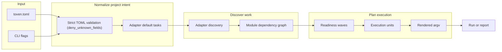
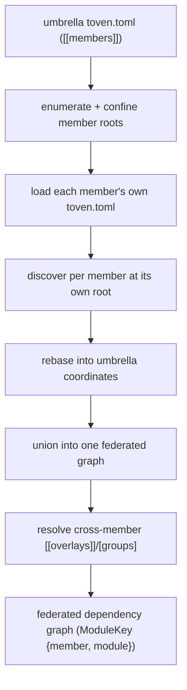
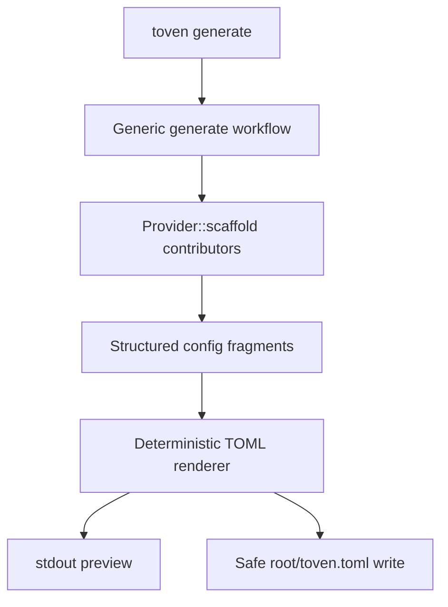
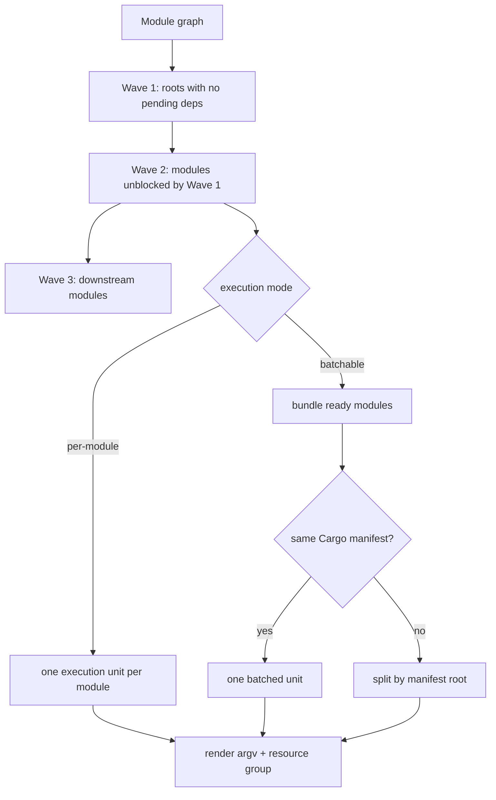
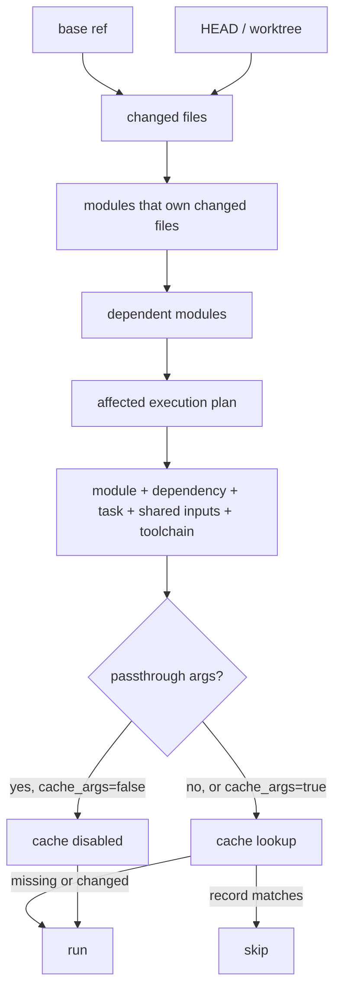

# Toven architecture

Toven is a **hexagonal, multi-crate workspace**. The domain vocabulary sits at the center, ports define the contracts that adapters and the engine speak, and the apps are thin wiring shells. The workspace contains `toven-model`, `toven-ports`, `toven-engine`, `toven-cli`, `toven-rust`, `toven-go`, `toven-command`, `toven-testkit`, the `toven`, `toven-rs`, and `toven-go` apps.

## Workspace layout

```text
crates/
  toven-model/     # identity, dependency graph, plan + event vocabulary; pure graph/topo/wave algos
  toven-ports/     # ports: Provider/ConfiguredAdapter, ReleaseTarget, Reporter, Vcs, RawOutputSink, ToolchainProber, SourceDigest, CacheStore + field-merge/Template/config helpers
  toven-engine/    # PLAN spine (load·configure·discover·graph·affected·toolchain·schedule) + APPLY exec/waves + release
  toven-rust/      # Rust adapter over the ports (cargo_metadata discovery, default tasks, toolchain probe)
  toven-go/        # Go adapter over the ports
  toven-command/   # generic command-driver adapter (out-of-proc RemoteAdapter envelope)
  toven-cli/       # CLI taxonomy, argv-first dispatch, Event-stream reporting sinks (Human/Jsonl) + exit mapping
apps/
  toven/           # umbrella binary (multi-ecosystem dispatch)
  toven-rs/        # Rust-focused binary
  toven-go/        # Go-focused binary
```

`mod.rs` files are declaration/re-export roots only — no logic or private items. CI enforces this with `make structure` across every `crates/*/src` tree.

## Layering rules

Dependencies flow **model → ports → adapters/engine → apps**, and never upward:

```text
L0  toven-model                      # foundational vocabulary + pure algorithms
L1  toven-ports                      # trait contracts over the model
L2  toven-rust, toven-go, toven-command, toven-engine   # adapters + orchestration over ports
L3  toven-cli                        # CLI taxonomy
L4  apps/{toven, toven-rs, toven-go} # thin wiring binaries
```

Key import boundaries:

- `toven-model` has no upward imports; it depends only on `rskit-errors`, `rskit-validation`, and `serde`/`serde_json`.
- Adapters (`toven-rust`, `toven-go`, `toven-command`) depend on `toven-ports` and `toven-model`, never on the engine, CLI, or apps.
- `toven-engine` owns the reserved-section schemas and the one strict `Document` loader that parses the single canonical `toven.toml`; `toven-ports` owns the shared `[ecosystems.<id>]` vocabulary (`CommonEcosystemConfig`) that each adapter flattens during its own `configure` parse. The engine does not own process stdio — raw child output and the Event stream are rendered only by `toven-cli`.
- `toven-cli` is the only layer that handles human command parsing and stdio projections; `apps/*` only wire dependencies together.

## rskit reuse

Toven builds on the checked-in [`rskit`](../rskit) submodule rather than bespoke primitives: process/worker/resilience for execution, git/fs for I/O, cache for memoized results, cli/util/version/component/validation for plumbing, and errors for typed failures. New foundational gaps are fixed generically in rskit, not worked around locally.

## Config and discovery flow



Rust discovery is Cargo-metadata backed. `[ecosystems.rust].manifests` allows multi-manifest repositories, and Cargo path dependencies are inferred across configured manifests. Adapters contribute their default task set, so a hand-written config can stay minimal.

Explicit `[[overlays]]` are top-level dependency edges for relationships that adapter metadata cannot prove.

## Cross-repo federation

A single `toven.toml` can describe either one repository or an **umbrella** that federates several. A *member* is an independently runnable Toven project: it carries its own authoritative `toven.toml` (its own `[ecosystems.*]`, tasks, groups, and overlays) and works on its own when you run Toven inside it. An umbrella file adds a `[[members]]` array that names each member and the repo-relative `root` it lives at, plus optional umbrella-level cross-member `[[overlays]]` and `[groups.*]`. The umbrella never rewrites a member's config; it only composes members and layers cross-member relationships on top.



After member discovery the engine owns **one** umbrella-coordinate federation. Every node is keyed by `ModuleKey { member, module }`: module *identity* stays two-level `ecosystem:name`, while the optional `member` qualifier disambiguates the same `ecosystem:name` exposed by two different members. Each member is discovered against its own root, then **rebased** so its module roots, workspace ids, source globs, and change paths are expressed relative to the umbrella root before the union. The degenerate single-repo project is the same code path with one implicit, unstamped member (`member = None`, empty prefix), so its plan stays byte-for-byte unchanged.

String references such as umbrella group entries may omit the `member/` qualifier when a bare `ecosystem:name` is unambiguous across the union; a bare ref that several members expose is a typed error with a member-qualified hint. Umbrella `[[overlays]]` endpoints are structured `{ ecosystem, module }` refs today, so each endpoint must resolve unambiguously across members. A declared member that is missing on disk, or present without its own `toven.toml`, is a hard error rather than a warn-and-skip — a declared member is a required graph node. Members are never provisioned implicitly: a run does not clone or check out anything, and missing member repos must be provisioned or cloned at their configured paths before planning.

Change selection and release are member-aware on top of this one graph. Each member resolves its own change baseline (its configured `base_ref`, or the same `--base <ref>` name applied independently per repo) and contributes umbrella-relative change records, so affected closure spans members through cross-member overlay edges. Release **planning** stays federated over the one graph and one topological publish order, while history mutations **shard per member**: each member repo gets its own clean-tree guardrail, release commit, and module tags, and publishing runs as one federated pass after the per-member commit boundary.

## Config generation flow



Existing configs are never replaced wholesale. Re-runs add missing `[ecosystems.<id>]` sections, preserve existing sections and `[project]`/`[toven]`, and `--force <id>` regenerates exactly one ecosystem section. Adapters contribute language/package specific fragments behind the generic `toven generate` workflow.

## Planning, waves, and bundling



Think of a wave as “everything that is safe to start now.” A module joins a later wave when one of its dependencies must finish first. `batchable` keeps ready modules together when the command can handle them together, but it still splits by Cargo manifest so selectors are never sent to the wrong workspace.

## Affected and cache decision flow



Explicit selection (`--module`/`--workspace`, optionally `--with-dependents`) short-circuits the changed-file diff at the top of this flow: the named targets (and, with `--with-dependents`, their reverse-dependents closure) become the active set directly, then feed the same cache and execution stages. It is mutually exclusive with the changed-selection baseline.

`shared_inputs` are task-owned, workspace-relative paths that participate in the shared hash for every module in the task. They are for broad invalidators such as lockfiles, toolchain files, lint config, and CI-relevant config. They must be plain paths inside the workspace: no templates, globs, `.` components, parent paths, or absolute paths.

## Extension points

- New language/package-manager adapters are new `crates/toven-<name>` crates that implement the `toven-ports` traits — they never reach into the engine, CLI, or apps.
- Adapter-specific config generation is contributed through `Provider::scaffold` behind the generic `toven generate` workflow.
- Multi-ecosystem dispatch is mediated by the umbrella `toven` app and `toven-command` for out-of-process command drivers over a stdio `toven-model` envelope.
- Shared foundational capabilities are improved in rskit generically when Toven exposes a reusable framework gap, rather than being reimplemented locally.
