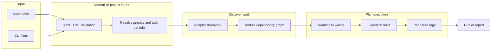
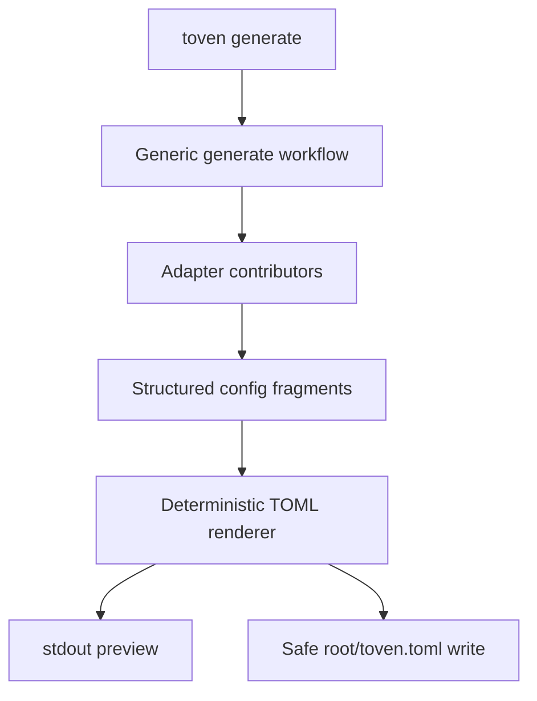
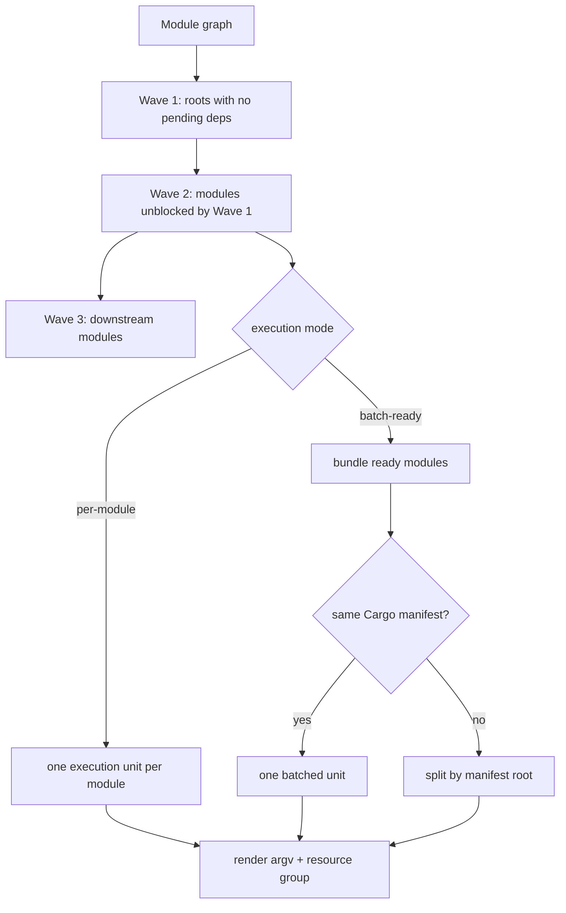
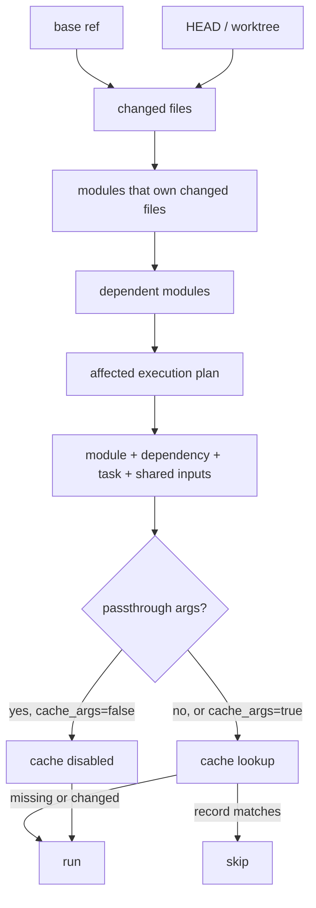

# Toven architecture

Toven is one Rust product crate with internal modules. Domain types stay in
`core`; higher layers consume normalized data instead of parsing config or
reaching upward into CLI code.

## Module layout

```text
src/
  core/        # identifiers, models, protocols, errors, templates
  config/      # strict TOML loading and normalization
  adapter/     # language/package discovery implementations
    rust/
      cargo/   # Cargo metadata loading and normalization
      generate/# Rust config generation contributor
  preset/      # preset resolution
  git/         # baseline and changed-file detection
  cache/       # successful-run cache storage and decisions
  engine/      # graph validation, scheduling, planning
  exec/        # command rendering and process execution
  generate/    # user-facing config generation workflow
  report/      # human/JSON/JSONL reporting
  cli/         # clap parsing and process IO
```

## Layering rules

```text
L0  core/
L1  config/, adapter/, preset/, git/, cache/
L2  engine/, exec/, generate/
L3  report/
L4  cli/
```

`mod.rs` files are declaration/re-export roots only. CI enforces this with
`make structure`.

Key import boundaries:

- `core/` has no upward imports.
- `config/`, `adapter/`, and `preset/` do not import `engine/`, `exec/`,
  `report/`, or `cli/`.
- `engine/` receives normalized workspace/modules/tasks as data.
- `exec/` renders and runs planned execution units; it does not parse config.
- `generate/` orchestrates config generation and calls adapter-owned generation
  contributors.
- `cli/` is the only layer that handles process stdio and human command parsing.

## Config and discovery flow



Rust discovery is Cargo-metadata backed. Profile-level `discovery.manifests`
allows multi-manifest repositories, and Cargo path dependencies are inferred
across configured manifests.

Explicit `[[overlays]]` are top-level dependency edges for relationships that
adapter metadata cannot prove.

## Config generation flow



Existing configs are never replaced by default. Writes use safe temporary-file
creation and an explicit overwrite path.

## Planning, waves, and bundling



Think of a wave as “everything that is safe to start now.” A module joins a
later wave when one of its dependencies must finish first. `batch-ready` keeps
ready modules together when the command can handle them together, but it still
splits by Cargo manifest so selectors are never sent to the wrong workspace.

## Affected and cache decision flow



`shared_inputs` are task-owned, workspace-relative paths that participate in the
shared hash for every module in the task. They are for broad invalidators such
as lockfiles, toolchain files, lint config, and CI-relevant config.

## Extension points

- New language/package-manager adapters should live under `src/adapter/<name>/`.
- Adapter-specific config generation should live under
  `src/adapter/<name>/generate/`.
- Generic generation orchestration belongs under `src/generate/`.
- Shared foundational capabilities should be improved in rskit generically when
  Toven exposes a reusable framework gap.
