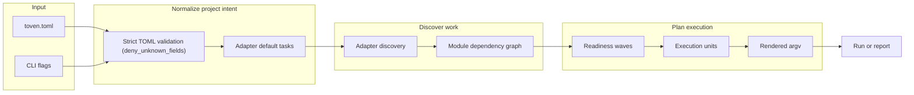
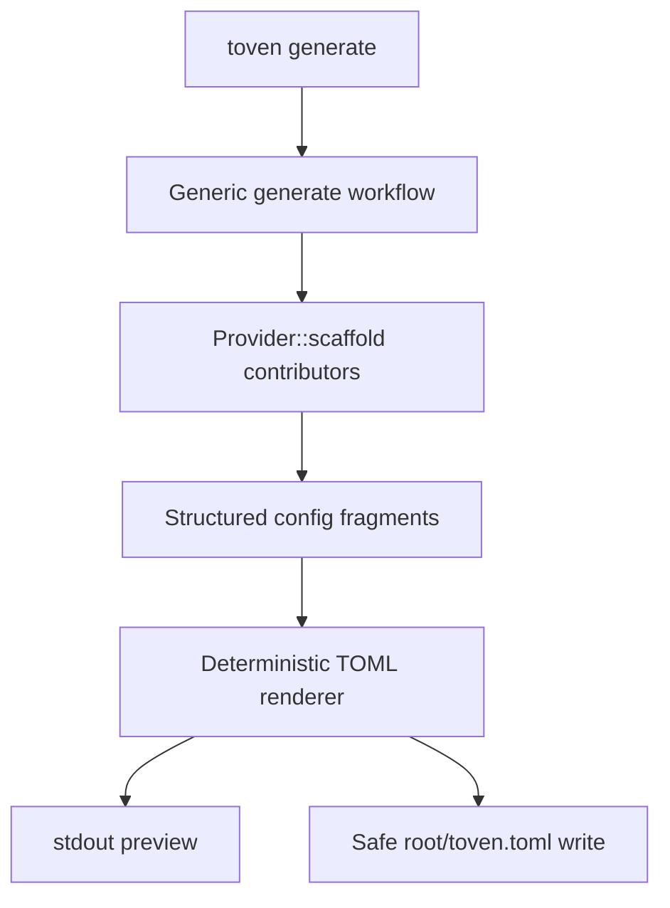
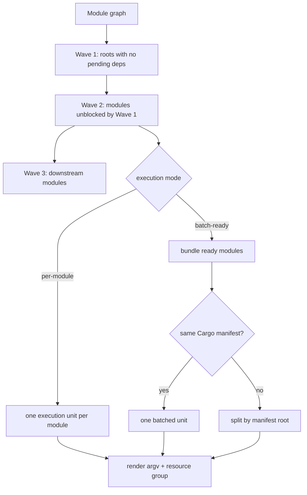
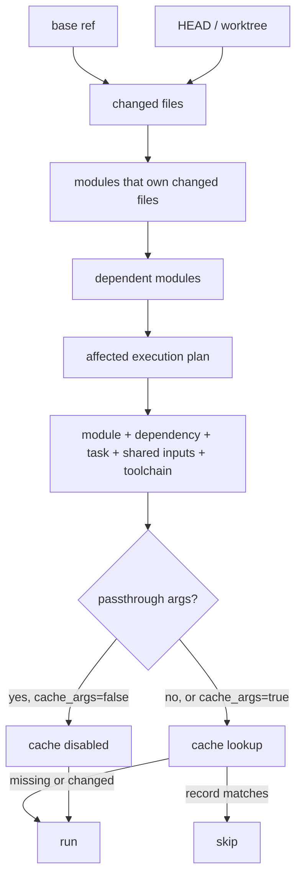

# Toven architecture

Toven is being rebuilt as a **hexagonal, multi-crate workspace**. The domain vocabulary sits at the center, ports define the contracts adapters and the engine speak, and the apps are thin wiring shells. This document describes the **target topology** the redesign is converging on; only the `toven-model` vocabulary crate is in the workspace today, with the remaining crates and apps landing as the later redesign steps complete.

> The previous single-crate `src/` tree was removed when the repository converted to this workspace. Its behavior is being re-homed into the crates below.

## Workspace layout

```text
crates/
  toven-model/     # identity, dependency graph, plan + event vocabulary; pure graph/topo/wave algos
  toven-ports/     # Provider/ConfiguredAdapter, ReleaseTarget, Reporter, Vcs traits + field-merge + Template helpers
  toven-engine/    # PLAN spine (load·configure·discover·graph·affected·toolchain·schedule) + APPLY exec/waves + release
  toven-rust/      # Rust adapter over the ports (cargo_metadata discovery, default tasks, toolchain probe)
  toven-go/        # Go adapter over the ports
  toven-command/   # generic command-driver adapter (out-of-proc RemoteAdapter envelope)
  toven-cli/       # CLI taxonomy, argv-first dispatch, PLAN-cut introspection projections
  toven/           # library facade that composes model + ports + engine + adapters
apps/
  toven/           # umbrella binary (multi-ecosystem dispatch)
  toven-rs/        # Rust-focused binary
  toven-go/        # Go-focused binary
```

`mod.rs` files are declaration/re-export roots only — no logic or private items. CI enforces this with `make structure` across every `crates/*/src` tree.

## Layering rules

Dependencies flow **model → ports → adapters/engine → apps**, and never upward:

```text
L0  toven-model                      # foundational vocabulary + pure algorithms
L1  toven-ports                      # trait contracts over the model
L2  toven-rust, toven-go, toven-command, toven-engine   # adapters + orchestration over ports
L3  toven-cli, toven                 # CLI taxonomy + library facade
L4  apps/{toven, toven-rs, toven-go} # thin wiring binaries
```

Key import boundaries:

- `toven-model` has no upward imports; it depends only on `rskit-errors`.
- Adapters (`toven-rust`, `toven-go`, `toven-command`) depend on `toven-ports` and `toven-model`, never on the engine, CLI, or apps.
- `toven-engine` receives normalized workspace/modules/tasks as data through the ports; it does not parse config or own process stdio.
- `toven-cli` is the only layer that handles human command parsing and stdio projections; `apps/*` only wire dependencies together.

## rskit reuse

Toven builds on the checked-in [`rskit`](../rskit) submodule rather than bespoke primitives: process/worker/resilience for execution, git/fs for I/O, cache for memoized results, cli/util/version/component/validation for plumbing, and errors for typed failures. New foundational gaps are fixed generically in rskit, not worked around locally.

## Config and discovery flow



Rust discovery is Cargo-metadata backed. Profile-level `discovery.manifests` allows multi-manifest repositories, and Cargo path dependencies are inferred across configured manifests. Adapters contribute their default task set, so a hand-written config can stay minimal.

Explicit `[[overlays]]` are top-level dependency edges for relationships that adapter metadata cannot prove.

## Config generation flow



Existing configs are never replaced by default. Writes use safe temporary-file creation and an explicit overwrite path. Adapters contribute language/package specific fragments behind the generic `toven generate` workflow.

## Planning, waves, and bundling



Think of a wave as “everything that is safe to start now.” A module joins a later wave when one of its dependencies must finish first. `batch-ready` keeps ready modules together when the command can handle them together, but it still splits by Cargo manifest so selectors are never sent to the wrong workspace.

## Affected and cache decision flow



`shared_inputs` are task-owned, workspace-relative paths that participate in the shared hash for every module in the task. They are for broad invalidators such as lockfiles, toolchain files, lint config, and CI-relevant config. They must be plain paths inside the workspace: no templates, globs, `.` components, parent paths, or absolute paths.

## Extension points

- New language/package-manager adapters are new `crates/toven-<name>` crates that implement the `toven-ports` traits — they never reach into the engine, CLI, or apps.
- Adapter-specific config generation is contributed through `Provider::scaffold` behind the generic `toven generate` workflow.
- Multi-ecosystem dispatch is mediated by `toven-command` (in-proc and out-of-proc `RemoteAdapter` over a stdio `toven-model` envelope).
- Shared foundational capabilities are improved in rskit generically when Toven exposes a reusable framework gap, rather than being reimplemented locally.
