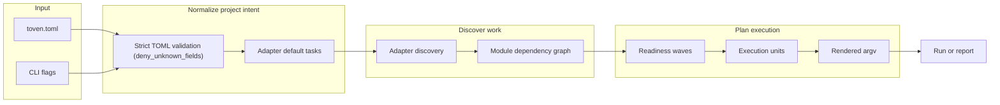
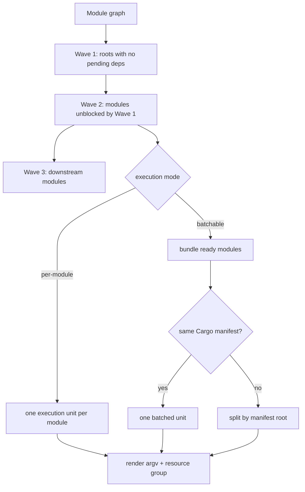
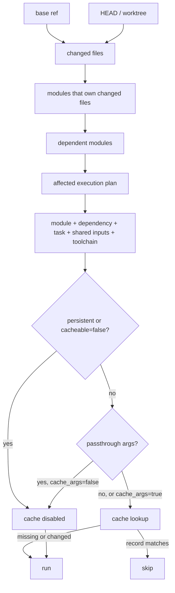
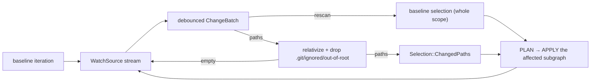
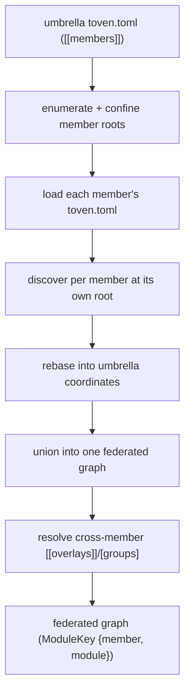
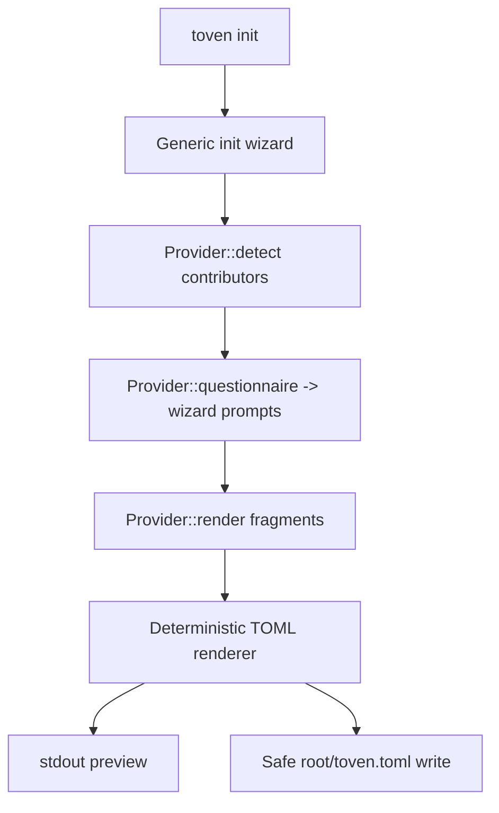

# Architecture

Toven is a hexagonal, multi-crate workspace. The domain vocabulary sits at the center, ports define the contracts adapters and the engine speak, and the apps are thin wiring shells.

## Workspace layout

```text
crates/
  toven-model/     # identity, dependency graph, plan + event vocabulary; pure graph/topo/wave algorithms
  toven-ports/     # port traits (Provider, ReleaseTarget, Reporter, Vcs, RawOutputSink, ToolchainProber, SourceDigest, CacheStore) + template/merge/config helpers
  toven-engine/    # PLAN spine (load, configure, discover, graph, affected, toolchain, schedule) + APPLY execution + release; the strict Document loader
  toven-rust/      # Rust adapter (cargo_metadata discovery, default tasks, toolchain probe)
  toven-go/        # Go adapter
  toven-command/   # generic out-of-process command-driver adapter
  toven-cli/       # CLI taxonomy, argv-first dispatch, Human/JSONL reporting sinks (the only layer that prints)
apps/
  toven/           # umbrella binary (multi-ecosystem dispatch)
  toven-rs/        # Rust-focused binary
  toven-go/        # Go-focused binary
```

`mod.rs` files declare and re-export only. `make structure` enforces this across every `crates/*/src` tree.

## Layering rules

Dependencies flow downward and never upward:

```text
L0  toven-model                                       # vocabulary + pure algorithms (the dependency root)
L1  toven-ports                                       # trait contracts over the model
L2  toven-rust, toven-go, toven-command, toven-engine # adapters + orchestration over ports
L3  toven-cli                                         # CLI taxonomy
L4  apps/{toven, toven-rs, toven-go}                  # thin wiring binaries
```

- `toven-model` depends only on `rskit-errors`, `rskit-validation`, and `serde`.
- Adapters depend on `toven-ports` and `toven-model`, never on the engine, CLI, or apps.
- `toven-engine` owns the strict `Document` loader that parses the canonical `toven.toml`; `toven-ports` owns the shared `[ecosystems.<id>]` vocabulary (`CommonEcosystemConfig`) each adapter flattens during its own `configure`.
- `toven-cli` is the only layer that parses human commands and writes stdio.

Toven builds on the vendored [`rskit`](../rskit) submodule for process, git/fs, cache, cli, and typed errors. Foundational gaps are fixed generically in rskit.

## Config and discovery flow



Rust discovery is backed by `cargo metadata`. `[ecosystems.rust].manifests` selects the Cargo workspace roots for a multi-workspace repo — either `"auto"` (re-discover first-level workspace roots every plan, minus `exclude`) or an explicit list — and Cargo path dependencies are inferred across them. Adapters contribute their default task set, so a hand-written config stays minimal. `[[overlays]]` add cross-ecosystem edges native metadata cannot prove.

Go discovery is backed by offline `go mod edit -json` / `go work edit -json` (no network, no module-graph resolution). `[ecosystems.go].modules` selects the managed `go.mod` modules — either `"auto"` (enumerate a root `go.work`'s members at any depth on every plan, or the root plus first-level nested `go.mod` when there is no workspace file) or an explicit list. In-repo `require`s become intra-ecosystem edges, and a root `go.work` groups its members into one workspace whose `go.work`/`go.work.sum` form the shared blast radius. Each module's identity is its repo-relative directory, so sibling modules sharing a leaf name (`connect/testutil`, `git/testutil`) stay distinct.

## Planning, waves, and bundling



A wave is everything safe to start now. A module joins a later wave when a dependency must finish first. A `batchable` task keeps ready modules together when the command can handle them, splitting by Cargo manifest so selectors reach the right workspace.

### Run strategies

Wave ordering is governed by a `run_strategy`, an engine-owned named policy chosen per ecosystem or task (the adapter supplies a per-kind default). Two strategies are the deliberate, complete set:

- **`leaf-to-top`** (the default) orders dependency-respecting waves — a dependency always runs before its dependents, so a build/test/lint sees its prerequisites already done.
- **`unordered`** collapses every active module into one wave, ignoring the dependency graph, for tasks with no inter-module ordering constraint (for example a formatter or a whole-workspace check) where waiting on the graph only serializes independent work.

This pair covers the shine points Toven is built on; a grouped or aggregate strategy is added only if a concrete Rust/Go need is demonstrated (with tests and docs), never speculatively.

### Ecosystem task entries vs. group task overrides

An ecosystem's `[ecosystems.<id>.tasks.<task>]` entries and a group's `[groups.<name>.tasks.<task>]` overrides look similar but play different roles and use different shapes.

An `[ecosystems.<id>.tasks.<task>]` entry is an **authoritative, complete task** (`TaskEntry`): the entry's name is the task's identity, so `argv` is required and the entry carries the full scheduling attributes (`selector`, `fan_out`, `persistent`, `readiness`, `cache_args`, `cacheable`, `fail_if_output`, `shared_inputs`). `toven init` writes a starter table into `toven.toml`, and the planner runs exactly what each entry declares — add, rename, or remove entries freely. An explicit `kind` is an optional recognition attribute that tags what a task *is* — for example `[ecosystems.rust.tasks.test-integration]` with `kind = "test"` is recognized as a test task (so it shares test-kind behavior such as dev-dependency edge propagation) while still being addressed by its own name, `toven test-integration`.

```toml
[ecosystems.rust.tasks.test]
argv = ["cargo", "test", "--manifest-path", "{module.manifest}", "{module.selector}", "{args}"]
fan_out = "batchable"
selector = ["-p", "{module.package}"]
shared_inputs = ["Cargo.lock"]

[ecosystems.rust.tasks.test-integration]
kind = "test"
argv = ["cargo", "nextest", "run", "--manifest-path", "{module.manifest}", "{module.selector}", "{args}"]
fan_out = "per-module"
selector = ["-p", "{module.package}"]
```

A `[groups.<name>.tasks.<task>]` override is a **sparse diff** (`TaskOverride`) that field-merges over the ecosystem task of the same addressable name, for the group's members only. Every field is optional: an unset field inherits the ecosystem base, scalars and lists **replace**, and `shared_inputs` is the one **additive** list (it unions into the member's cache-key footprint). It does not need `argv`, because it refines an already-complete task rather than defining one.

```toml
[groups.integration]
run_strategy = "unordered"

[groups.integration.tasks.test]
argv = ["cargo", "nextest", "run", "--profile", "ci"]
```

So an `integration` group can run `test` with `cargo nextest run --profile ci` and `run_strategy = "unordered"` while the rest of the workspace keeps the defaults.

The task merge order is `ecosystem [tasks] entry → group [tasks] override`, and the resolved origin (`project` or `group`) shows per unit in `toven explain`. A group override is keyed by the task's addressable name, so `[groups.<name>.tasks.test-integration]` refines the `test-integration` task, while `[groups.<name>.tasks.test]` refines the `test` task. A module reached by two groups that both override the same task or `run_strategy` is a hard error, so overrides stay explicit.

## Sharing task configuration

Factor reusable tasks, groups, or overlays into a file and pull it in:

```toml
[toven]
include = ["ci/shared-tasks.toml"]
```

`include` is a list of repository-relative files merged beneath `toven.toml` as defaults; the canonical `toven.toml` wins on collisions. Duplicate `[[members]]`, `[[overlays]]`, or `[groups.<name>]` entries across files are a hard error. Every included file must be committed, keeping each plan deterministic.

## Affected and cache decision flow



A task authored `cacheable = false` is statically excluded from the cache, exactly as a `persistent` task is. This is the correctness rule for **mutating** tasks (such as Go's `format` / `tidy-fix`): a mutation must run on every invocation, so a stale content-key hit can never suppress it — for example manually un-formatting a file yields the same source digest as the pre-`format` state, which would otherwise register as a cache hit and skip the re-format.

A task's `shared_inputs` are validated at plan time as literal, traversal-safe relative paths (no globs or unresolved templates) and folded into the key as a `(path, digest)` pair. A declared input that is missing on disk hashes to the empty digest — an absent state that is provably distinct from every present state, including a present but empty file, because file contents are length-prefix framed. A vanished shared input therefore re-keys the unit rather than silently aliasing a real one into a false hit.

Explicit selection (`--module`/`--workspace`, optionally `--dependents` and/or `--dependencies`) short-circuits the changed-file diff: the named targets become the active set directly, then feed the same cache and execution stages. Selectors are lenient input — bare name, `ecosystem:name`, `workspace/name`, or glob, resolved against the graph — while every listing stays the canonical `ecosystem:name` form. It is mutually exclusive with the baseline flags. See [what invalidates cache](commands/cache.md#what-invalidates-cache) for the full list of cache inputs.

A changed path that owns no module — a `toven.toml` edit, a root-level file, or the untracked `toven.toml` right after `init` — fails closed to full activation (every module), because the config can alter any module's plan. The engine returns the unattributable path(s) as typed data on the affected result; the CLI renders a `full activation: <path> (affects all modules)` diagnostic (on the `affected` projection's stdout, or the human reporter's stderr during a run), so the widening is never silent.

## Watch mode

`--watch` turns a task run into a rerun loop. The engine runs one baseline iteration, then drives an injected `WatchSource` port that yields a debounced `ChangeBatch`. The production adapter implements it over rskit-fs's filesystem watcher.



Each batch is relativized against the workspace root and filtered to drop `.git` and ignored paths. Remaining paths map to a changed-path selection that plans and applies exactly the affected units. If the watcher drops events, the batch carries a rescan signal and the loop re-evaluates the caller's baseline selection instead of trusting a partial list. One Ctrl+C cancels the in-flight run and exits with the last iteration's summary. See [watch mode](commands/run.md#watch-mode) for usage.

## Cross-repo federation

A `toven.toml` describes one repository or an umbrella that federates several. A member is an independently runnable Toven project with its own `toven.toml` — its own `[ecosystems.*]`, tasks, groups, and overlays. An umbrella adds a `[[members]]` array naming each member and its repo-relative `root`, plus optional cross-member `[[overlays]]` and `[groups.*]`. The umbrella composes members; it never rewrites a member's config.



Every node is keyed by `ModuleKey { member, module }`. Module identity stays two-level `ecosystem:name`; the `member` qualifier disambiguates the same `ecosystem:name` exposed by two members. Each member is discovered against its own root, then rebased so its roots, workspace ids, and change paths are expressed relative to the umbrella root.

A bare `ecosystem:name` reference is allowed when it is unambiguous across the union; an ambiguous one is a typed error with a member-qualified hint. A declared member missing on disk, or lacking its own `toven.toml`, is a hard error — Toven never clones or checks out member repos. Provision members at their configured paths before planning.

Affected planning and release both operate over the one graph. Each member resolves its own change baseline (its `base_ref`, or `--base <ref>` applied per repo), so affected closure spans members through cross-member overlay edges. Release planning stays federated over one topological publish order, while commits and tags shard per member repo.

## Config onboarding flow



Each adapter detects whether it applies, contributes a questionnaire the wizard prompts through, and renders a language-specific fragment — including the complete task table — from the answers. Re-runs add missing `[ecosystems.<id>]` sections and preserve existing ones. See [onboarding a repository](commands/init.md).

## Extension points

- A new language adapter is a `crates/toven-<name>` crate implementing the `toven-ports` traits. It never reaches into the engine, CLI, or apps.
- Adapter-specific config onboarding is contributed through `Provider::detect`, `Provider::questionnaire`, and `Provider::render`.
- Out-of-process command drivers are mediated by the umbrella `toven` app and `toven-command` over a stdio `toven-model` envelope.
- Shared foundational capabilities are improved in rskit generically when Toven exposes a reusable gap.
