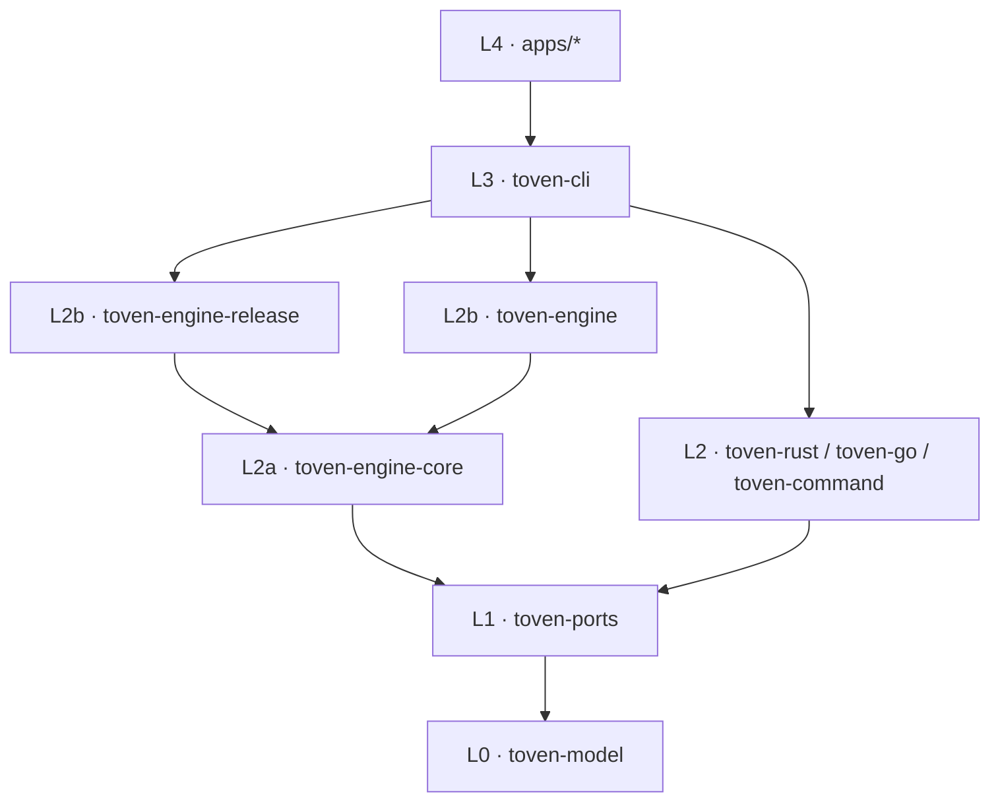

# Architecture

Toven is a hexagonal Rust workspace. Domain types sit at the center, ports define contracts, adapters integrate ecosystems and infrastructure, the engine coordinates plans and execution, and applications perform final wiring.

## Workspace layers

```text
L0  crates/toven-model
L1  crates/toven-ports
L2a crates/toven-engine-core
L2b crates/toven-engine-release
L2b crates/toven-engine
L2  crates/toven-rust
L2  crates/toven-go
L2  crates/toven-command
L3  crates/toven-cli
L4  apps/toven, apps/toven-rs, apps/toven-go
```

Dependencies point downward only. The three engine crates share layer 2: `toven-engine-core` is the PLAN foundation, and `toven-engine-release` and `toven-engine` are peers above it.



| Crate | Responsibility |
|---|---|
| `toven-model` | Identity, graph, plan, event, and release vocabulary |
| `toven-ports` | Adapter contracts and shared configuration values |
| `toven-engine-core` | Strict `toven.toml` loading, the VCS seam, the PLAN spine, and federation-core |
| `toven-engine-release` | Release PLAN/APPLY: bump, changelog, packaging, checksums, SBOM, signing, hosted publishing |
| `toven-engine` | Apply, cache, coverage, output, watch, init, doctor, and the rskit-backed port adapters |
| `toven-rust` | Cargo discovery and Rust task/release behavior |
| `toven-go` | Go discovery and Go task/release behavior |
| `toven-command` | Out-of-process ecosystem driver integration |
| `toven-cli` | Command grammar and output projection |
| `toven-testkit` | Shared fixtures, doubles, and smoke support |
| `apps/*` | Thin binary wiring |

`lib.rs` and `mod.rs` files declare and re-export modules only. `make structure` enforces this rule.

## Plan and apply


The stages separate repository intent from execution. Input captures the command and repository-owned configuration. Resolve validates that intent and discovers the dependency graph. Plan selects scope, schedules work, renders argv, and decides cache reuse without mutating the repository. Apply executes the plan and records successful results. Output keeps human diagnostics on stderr and data projections on stdout.

## Configuration ownership

The engine owns strict loading of `toven.toml`. Ecosystem adapters own their discovery and default task behavior. Shared configuration values live in `toven-ports`; engine-specific resolved state does not leak into ports.

## Discovery

### Rust

The Rust adapter uses Cargo metadata. It discovers packages, workspace ownership, targets, and path dependencies across configured manifests.

### Go

The Go adapter uses offline `go mod edit -json` and `go work edit -json`. Repository-relative module roots provide stable identity, including modules with the same leaf directory name.

### Overlays and federation

Overlays add edges native metadata cannot prove. Federation composes independently configured member repositories into one graph without merging their repository ownership.

## Scheduling

Dependency-respecting tasks run in readiness waves. A module enters a later wave until its dependencies finish. `unordered` tasks collapse selected modules into one wave when graph ordering is unnecessary.

Batchable tasks combine compatible modules into one execution unit. Per-module tasks create one unit per module.

## Multi-workspace graph and parallel execution

Toven discovers each configured Rust workspace and Go module set independently, then composes their modules into one project graph. Native metadata supplies same-ecosystem edges; overlays supply cross-ecosystem edges.


Modules inside one wave are independent for the selected task and may execute concurrently. `--jobs <N>` or `[toven].max_parallel` bounds how many units run at once; it does not remove dependency barriers. A batchable task may combine compatible modules in the same wave into fewer process invocations.

Affected planning changes the active subgraph, not the dependency rules. For example, a change in `rust:core` activates its dependents, while an isolated `go:api` change can select only the Go branch unless an overlay connects it to another workspace.

### Scheduling approaches

| Approach | Selection | Ordering | Typical use |
|---|---|---|---|
| Full graph | Every eligible module | Dependency waves | Complete CI or release readiness |
| Affected graph | Changed modules plus dependents | Dependency waves | Pull-request validation |
| Explicit scope | Selected modules with optional dependencies or dependents | Dependency waves | Focused development |
| Unordered | Selected modules | One logical wave | Formatting or independent checks |
| Batchable | Compatible modules in a wave | Dependency-safe batches | Tools that accept multiple package selectors |
| Per-module | One unit per module | Dependency waves | Isolation, module-specific output, or non-batchable tools |

## Process execution

Commands are argument vectors by default. User argv is not rewritten. Runtime output is observed and projected by the CLI layer; libraries return typed results and do not print.

On Unix terminals, live units may use PTYs to preserve color and progress rendering. Non-terminal and unsupported environments use deterministic stream output.

## Ports and adapters

A port trait lives in `toven-ports`. Its production adapter lives in the consuming engine or ecosystem crate. Each port has one shared test double in `toven-testkit`.

Shared concerns such as errors, filesystem, Git, process execution, validation, and logging reuse the vendored rskit implementation. See [concern ownership](concern-owners.md).

## Release architecture

Release planning uses the same dependency graph as tasks. Ecosystem release targets own version and tag conventions. The engine coordinates selection, cascade, readiness, commit, tag, push, publish, and hosted release phases.

Hosted releases use a separate forge port. GitHub integration invokes `gh` with argv and ambient authentication.

### Release flow and phases

The release is modeled as a **flow**: an ordered set of named phases the engine orchestrates.

```text
select → bump → tag → package → sign → publish → host → provenance
```

The phase vocabulary is `ReleasePhase` in `toven-model` — pure, descriptive names, no behavior. For **every** phase, the engine owns four guarantees, independent of how the phase is backed:

| Guarantee | Meaning |
| --- | --- |
| Mutation-free preview | Preview observes without changing the repository or any target. |
| Gated mutation | Real mutation requires `--yes` + an allowed branch + a clean tree. |
| Immutable, forward-fix outputs | Tags, registry versions, hosted Releases, assets, and image tags never change; recovery is a new forward-fix version. |
| Typed reporting | Output is typed JSONL/human on the correct stream. |

A phase's *implementation* is a swappable seam described by `PhaseBacking` in `toven-ports`: `Native` (Toven's own code, the default) or `Delegated { tool }` (an external tool invoked argv-first). Delegation is per-phase and opt-in; a delegated phase that cannot preview mutation-free is not an acceptable delegation, so the guarantee table binds both backings equally. Toven never hands the whole flow to an external tool. Per-phase backing is declared under `[…release.phases.<phase>]` (see [release configuration](config/release.md#release-phases-and-backing)).

### Phase seam decomposition

The ecosystem sliver is a set of **per-phase contracts** in `toven-ports`, composed by the `ReleaseAdapter` marker trait (a blanket impl over all six). `ConfiguredAdapter::release_target` hands the engine one native trait object it resolves per phase, so each phase is independently backed `Native` or `Delegated`. The per-phase traits and the redesign decision behind each:

| Per-phase contract (method) | Phase | Decision |
| --- | --- | --- |
| `VersionSource::declared_version` | Bump | Align — a version-read seam under the Bump phase. |
| `ManifestMutator::apply_release` | Bump | Align — the manifest version-write seam under Bump; the standalone bump verb extracts around it. |
| `TagGrammar::tag_scheme` | Tag | Align — the tag-grammar seam under the Tag phase. |
| `Packager::package` | Package | Redesign — its own Package phase contract, delegable. |
| `SbomProducer::sbom` | Provenance | Redesign — folds into the Provenance phase; the `Ok(None)` default becomes an explicit backing. |
| `VersionSource::published_versions` | Publish | Align — the registry-query (idempotency) seam under Publish. |
| `Publisher::publish` | Publish | Redesign — its own Publish phase contract, delegable. |
| (engine sign) | Sign | Enhance — the engine-owned tag/artifact signing becomes an explicit Sign phase contract. |
| (engine selection) | Select | Align — the existing selection/cascade/ordering is named as the Select phase. |
| `ReleaseHost` port | Host | Align — the existing hosted-forge port is named as the Host phase. |

A delegated phase is driven through the `DelegatedPhase` port: the engine builds a fully-resolved, argv-first `DelegatedPhaseRequest` (tool-first argument vector, mutation-free preview vs. mutating apply argv, secrets named on the child environment — never on argv) and the engine-side `ProcessDelegatedPhase` runner spawns it via the rskit process port and reports a classified exit.

## Output boundary

Only `toven-cli` writes user-facing output:

- stdout carries projections and JSONL.
- stderr carries progress, child output, warnings, summaries, and errors.

See [command output streams](commands/README.md#output-streams).
