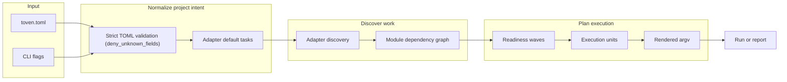
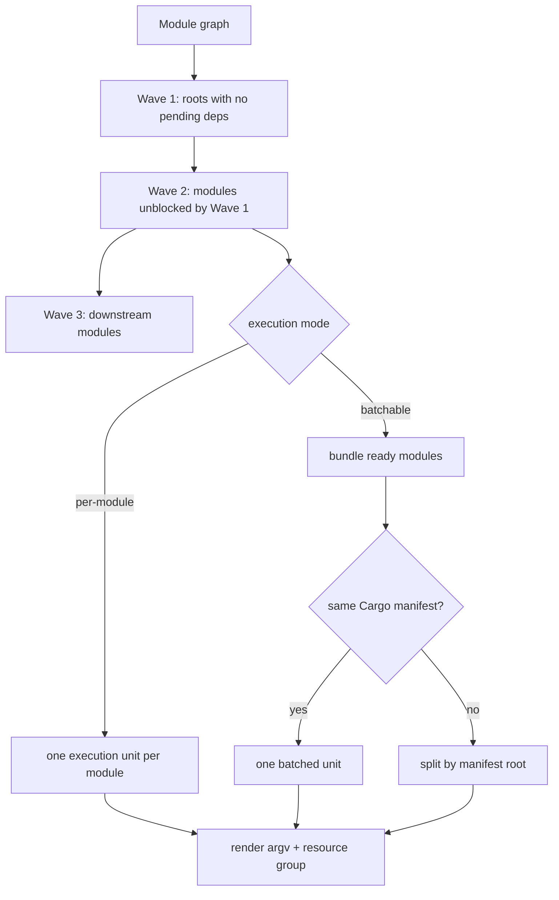
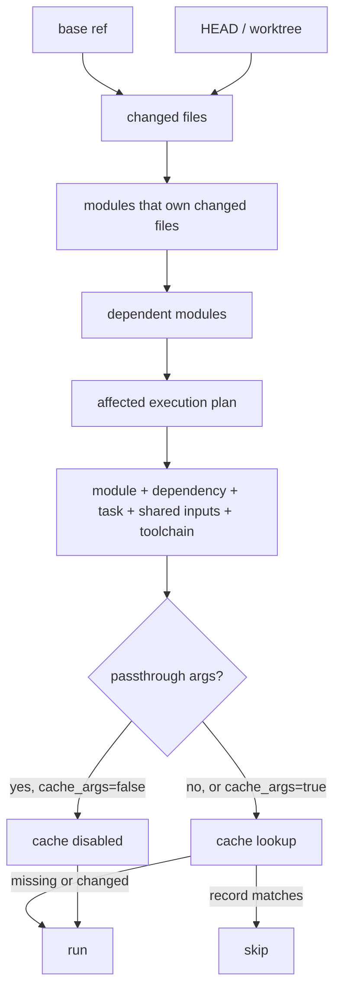
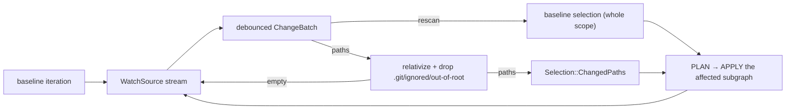
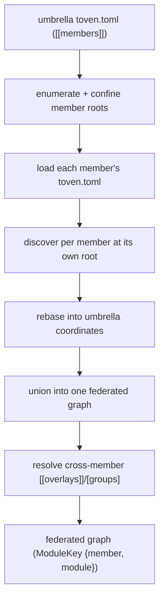
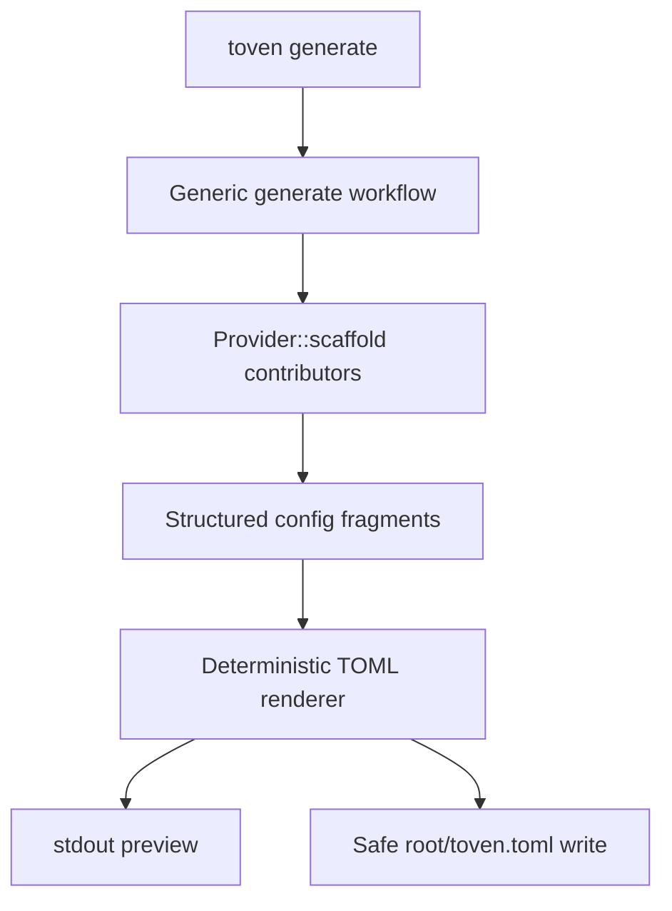

# Architecture

Toven is a hexagonal, multi-crate workspace. The domain vocabulary sits at the center, ports define the contracts adapters and the engine speak, and the apps are thin wiring shells.

## Workspace layout

```text
crates/
  toven-model/     # identity, dependency graph, plan + event vocabulary; pure graph/topo/wave algorithms
  toven-ports/     # port traits (Provider, ReleaseTarget, Reporter, Vcs, RawOutputSink, ToolchainProber, SourceDigest, CacheStore) + template/merge/config helpers
  toven-engine/    # PLAN spine (load, configure, discover, graph, affected, toolchain, schedule) + APPLY execution + release; the strict Document loader
  toven-rust/      # Rust adapter (cargo_metadata discovery, default tasks, toolchain probe)
  toven-go/        # Go adapter
  toven-command/   # generic out-of-process command-driver adapter
  toven-cli/       # CLI taxonomy, argv-first dispatch, Human/JSONL reporting sinks (the only layer that prints)
apps/
  toven/           # umbrella binary (multi-ecosystem dispatch)
  toven-rs/        # Rust-focused binary
  toven-go/        # Go-focused binary
```

`mod.rs` files declare and re-export only. `make structure` enforces this across every `crates/*/src` tree.

## Layering rules

Dependencies flow downward and never upward:

```text
L0  toven-model                                       # vocabulary + pure algorithms (the dependency root)
L1  toven-ports                                       # trait contracts over the model
L2  toven-rust, toven-go, toven-command, toven-engine # adapters + orchestration over ports
L3  toven-cli                                         # CLI taxonomy
L4  apps/{toven, toven-rs, toven-go}                  # thin wiring binaries
```

- `toven-model` depends only on `rskit-errors`, `rskit-validation`, and `serde`.
- Adapters depend on `toven-ports` and `toven-model`, never on the engine, CLI, or apps.
- `toven-engine` owns the strict `Document` loader that parses the canonical `toven.toml`; `toven-ports` owns the shared `[ecosystems.<id>]` vocabulary (`CommonEcosystemConfig`) each adapter flattens during its own `configure`.
- `toven-cli` is the only layer that parses human commands and writes stdio.

Toven builds on the vendored [`rskit`](../rskit) submodule for process, git/fs, cache, cli, and typed errors. Foundational gaps are fixed generically in rskit.

## Config and discovery flow



Rust discovery is backed by `cargo metadata`. `[ecosystems.rust].manifests` lists the manifests for a multi-workspace repo, and Cargo path dependencies are inferred across them. Adapters contribute their default task set, so a hand-written config stays minimal. `[[overlays]]` add cross-ecosystem edges native metadata cannot prove.

## Planning, waves, and bundling



A wave is everything safe to start now. A module joins a later wave when a dependency must finish first. A `batchable` task keeps ready modules together when the command can handle them, splitting by Cargo manifest so selectors reach the right workspace.

### Group-scoped task and strategy overrides

A `[groups.<name>]` can carry a group-scoped `run_strategy` and `[groups.<name>.tasks.<task>]` map, reusing the same `TaskOverride` shape as `[ecosystems.<id>.tasks.<task>]`. They apply to the group's members only, so a subset of a repo runs a task differently without a new ecosystem. For example, an `integration` group can run `test` with `cargo nextest run --profile ci` and `run_strategy = "unordered"` while the rest of the workspace keeps the defaults.

The task merge order is `adapter default → ecosystem [tasks] → group [tasks]`, and the resolved origin (`adapter-default`, `project`, or `group`) shows per unit in `toven explain`. A module reached by two groups that both override the same task or `run_strategy` is a hard error, so overrides stay explicit. Group `tasks` overrides may add `shared_inputs`, which union into the member's cache-key footprint.

## Sharing task configuration

Factor reusable tasks, groups, or overlays into a file and pull it in:

```toml
[toven]
include = ["ci/shared-tasks.toml"]
```

`include` is a list of repository-relative files merged beneath `toven.toml` as defaults; the canonical `toven.toml` wins on collisions. Duplicate `[[members]]`, `[[overlays]]`, or `[groups.<name>]` entries across files are a hard error. Every included file must be committed, keeping each plan deterministic.

## Affected and cache decision flow



Explicit selection (`--module`/`--workspace`, optionally `--with-dependents`) short-circuits the changed-file diff: the named targets become the active set directly, then feed the same cache and execution stages. It is mutually exclusive with the baseline flags. See [what invalidates cache](commands/cache.md#what-invalidates-cache) for the full list of cache inputs.

## Watch mode

`--watch` turns a task run into a rerun loop. The engine runs one baseline iteration, then drives an injected `WatchSource` port that yields a debounced `ChangeBatch`. The production adapter implements it over rskit-fs's filesystem watcher.



Each batch is relativized against the workspace root and filtered to drop `.git` and ignored paths. Remaining paths map to a changed-path selection that plans and applies exactly the affected units. If the watcher drops events, the batch carries a rescan signal and the loop re-evaluates the caller's baseline selection instead of trusting a partial list. One Ctrl+C cancels the in-flight run and exits with the last iteration's summary. See [watch mode](commands/run.md#watch-mode) for usage.

## Cross-repo federation

A `toven.toml` describes one repository or an umbrella that federates several. A member is an independently runnable Toven project with its own `toven.toml` — its own `[ecosystems.*]`, tasks, groups, and overlays. An umbrella adds a `[[members]]` array naming each member and its repo-relative `root`, plus optional cross-member `[[overlays]]` and `[groups.*]`. The umbrella composes members; it never rewrites a member's config.



Every node is keyed by `ModuleKey { member, module }`. Module identity stays two-level `ecosystem:name`; the `member` qualifier disambiguates the same `ecosystem:name` exposed by two members. Each member is discovered against its own root, then rebased so its roots, workspace ids, and change paths are expressed relative to the umbrella root.

A bare `ecosystem:name` reference is allowed when it is unambiguous across the union; an ambiguous one is a typed error with a member-qualified hint. A declared member missing on disk, or lacking its own `toven.toml`, is a hard error — Toven never clones or checks out member repos. Provision members at their configured paths before planning.

Affected planning and release both operate over the one graph. Each member resolves its own change baseline (its `base_ref`, or `--base <ref>` applied per repo), so affected closure spans members through cross-member overlay edges. Release planning stays federated over one topological publish order, while commits and tags shard per member repo.

## Config generation flow



Adapters contribute language-specific fragments behind the generic workflow. Re-runs add missing `[ecosystems.<id>]` sections and preserve existing ones. See [generating config](commands/generate.md).

## Extension points

- A new language adapter is a `crates/toven-<name>` crate implementing the `toven-ports` traits. It never reaches into the engine, CLI, or apps.
- Adapter-specific config generation is contributed through `Provider::scaffold`.
- Out-of-process command drivers are mediated by the umbrella `toven` app and `toven-command` over a stdio `toven-model` envelope.
- Shared foundational capabilities are improved in rskit generically when Toven exposes a reusable gap.
