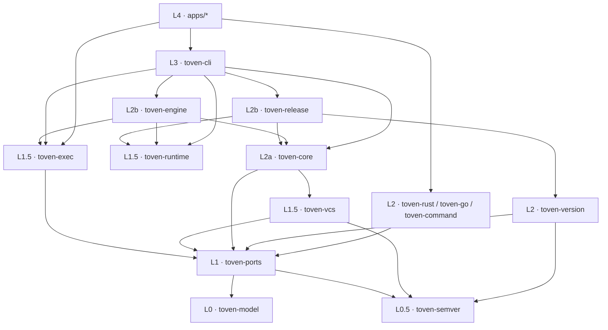
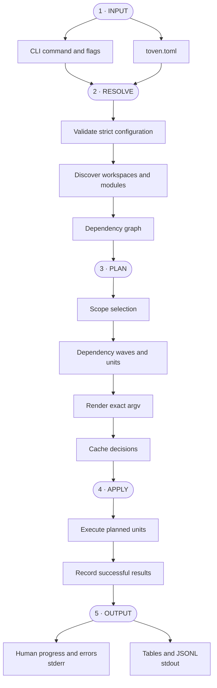
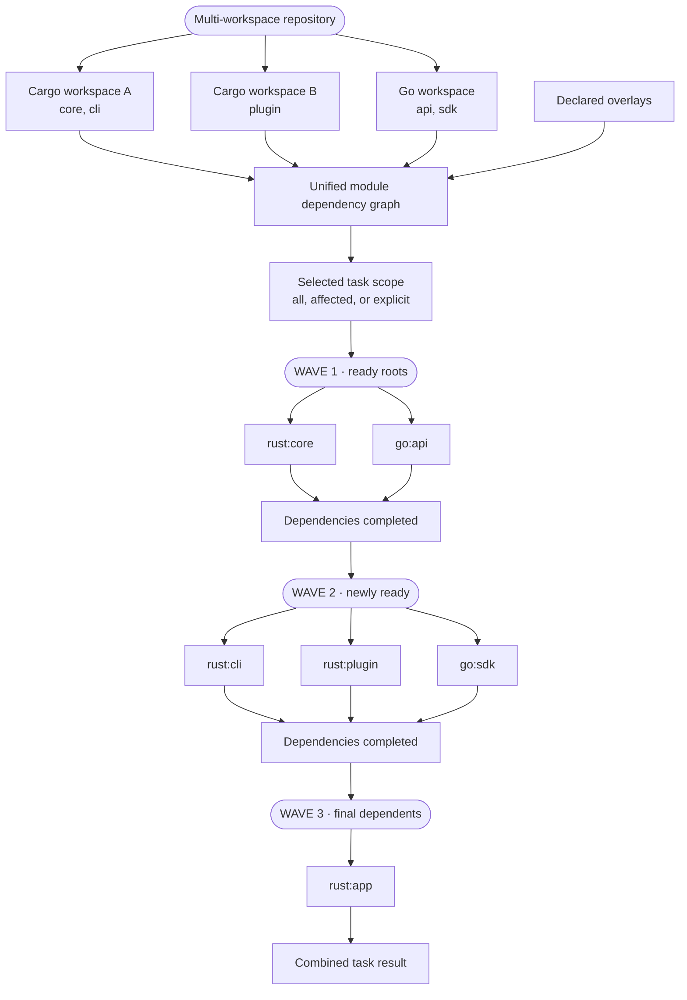
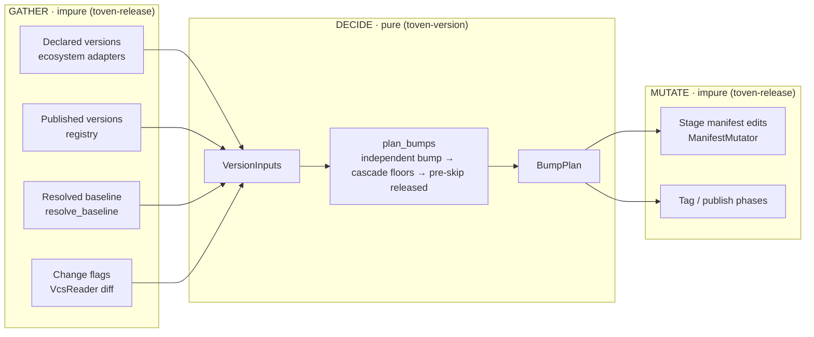

# Architecture

Toven is a hexagonal Rust workspace. Domain types sit at the center, ports define contracts, adapters integrate ecosystems and infrastructure, the engine coordinates plans and execution, and applications perform final wiring.

## Workspace layers

```text
L0   crates/toven-model
L0.5 crates/toven-semver
L1   crates/toven-ports
L1.5 crates/toven-exec
L1.5 crates/toven-vcs
L1.5 crates/toven-runtime
L2a  crates/toven-core
L2   crates/toven-version
L2b  crates/toven-release
L2b  crates/toven-engine
L2   crates/toven-rust
L2   crates/toven-go
L2   crates/toven-command
L3   crates/toven-cli
L4   apps/toven, apps/toven-rs, apps/toven-go
```

Dependencies point downward only. `toven-semver` is a pure L0.5 toolkit — semver bump math and the release-tag codec, reusable by any layer, depending on no other Toven crate. `toven-exec`, `toven-vcs`, and `toven-runtime` are focused L1.5 utilities — `toven-exec` owns the concrete subprocess runners, `toven-vcs` owns the git mechanism behind the VCS ports, and `toven-runtime` owns the generic streaming, wave-scheduled, bounded-parallel unit-operation engine (shared GATHER → per-unit STREAM) that the streamed `release` verbs run on today (`run` and `coverage` are not yet migrated). `toven-version` is the L2 version-decision capability whose pure `plan_bumps` is the single path every bump flows through; the three engine crates share layer 2 above `toven-core`, with `toven-release` composing `toven-version` for its bump phase.



Only the thin `apps/*` binaries wire the ecosystem adapters (`toven-rust`, `toven-go`, `toven-command`) into the CLI; `toven-cli` itself depends on the engine crates and the shared foundation, never on a concrete ecosystem adapter.

| Crate | Responsibility |
|---|---|
| `toven-model` | Identity, graph, plan, event, and release vocabulary |
| `toven-semver` | Pure semver bump math and the release-tag codec/selection (`next_version`, `TagScheme`, `latest_matching`) |
| `toven-ports` | Adapter contracts and shared configuration values |
| `toven-exec` | The concrete subprocess runners (`ProcessToolRunner`, `ProcessCommandRunner`, persistent spawn) and the shared argv→`ProcessSpec` lowering |
| `toven-vcs` | The git mechanism: the rskit-git-backed `VcsReader`/`VcsWriter` adapter, the change foundation (diff-range resolution), and the per-repo reader-set fan-out |
| `toven-runtime` | The generic streaming, wave-scheduled, bounded-parallel unit-operation engine: the unit graph + dependency-wave levelling, fail-closed gating, the shared-GATHER/per-unit `UnitOperation` seam, and the typed per-unit lifecycle the streamed `release` verbs stream through (`run`/`coverage` not yet migrated) |
| `toven-core` | Strict `toven.toml` loading, the engine-owned VCS baseline policy over the git seam, the PLAN spine, and federation-core |
| `toven-version` | The pure `plan_bumps` bump/cascade/idempotency decision, baseline anchoring, entrypoint/`CutIntent` policy, change detection, and Conventional-Commit changelog generation |
| `toven-release` | Release PLAN/APPLY flow: tag, package, checksums, SBOM, signing, hosted publishing — composing `toven-version` for the bump decision |
| `toven-engine` | Apply, cache, coverage, output, watch, init, doctor, and the rskit-backed port adapters |
| `toven-rust` | Cargo discovery and Rust task/release behavior |
| `toven-go` | Go discovery and Go task/release behavior |
| `toven-command` | Out-of-process ecosystem driver integration |
| `toven-cli` | Command grammar and output projection |
| `toven-testkit` | Shared fixtures, doubles, and smoke support |
| `apps/*` | Thin binary wiring |

`lib.rs` and `mod.rs` files declare and re-export modules only. `make structure` enforces this rule.

## Plan and apply



The stages separate repository intent from execution. Input captures the command and repository-owned configuration. Resolve validates that intent and discovers the dependency graph. Plan selects scope, schedules work, renders argv, and decides cache reuse without mutating the repository. Apply executes the plan and records successful results. Output keeps human diagnostics on stderr and data projections on stdout.

## Configuration ownership

The engine owns strict loading of `toven.toml`. Ecosystem adapters own their discovery and default task behavior. Shared configuration values live in `toven-ports`; engine-specific resolved state does not leak into ports.

## Discovery

### Rust

The Rust adapter uses Cargo metadata. It discovers packages, workspace ownership, targets, and path dependencies across configured manifests.

### Go

The Go adapter uses offline `go mod edit -json` and `go work edit -json`. Repository-relative module roots provide stable identity, including modules with the same leaf directory name.

### Overlays and federation

Overlays add edges native metadata cannot prove. Federation composes independently configured member repositories into one graph without merging their repository ownership.

## Scheduling

Dependency-respecting tasks run in readiness waves. A module enters a later wave until its dependencies finish. `unordered` tasks collapse selected modules into one wave when graph ordering is unnecessary.

Batchable tasks combine compatible modules into one execution unit. Per-module tasks create one unit per module.

## Multi-workspace graph and parallel execution

Toven discovers each configured Rust workspace and Go module set independently, then composes their modules into one project graph. Native metadata supplies same-ecosystem edges; overlays supply cross-ecosystem edges.



Modules inside one wave are independent for the selected task and may execute concurrently. `--jobs <N>` or `[toven].max_parallel` bounds how many units run at once; it does not remove dependency barriers. A batchable task may combine compatible modules in the same wave into fewer process invocations.

Affected planning changes the active subgraph, not the dependency rules. For example, a change in `rust:core` activates its dependents, while an isolated `go:api` change can select only the Go branch unless an overlay connects it to another workspace.

### Scheduling approaches

| Approach | Selection | Ordering | Typical use |
|---|---|---|---|
| Full graph | Every eligible module | Dependency waves | Complete CI or release readiness |
| Affected graph | Changed modules plus dependents | Dependency waves | Pull-request validation |
| Explicit scope | Selected modules with optional dependencies or dependents | Dependency waves | Focused development |
| Unordered | Selected modules | One logical wave | Formatting or independent checks |
| Batchable | Compatible modules in a wave | Dependency-safe batches | Tools that accept multiple package selectors |
| Per-module | One unit per module | Dependency waves | Isolation, module-specific output, or non-batchable tools |

## Change foundation

"What changed between two points" is one reusable concern, not a per-verb reimplementation. The `toven-core` change foundation resolves a `DiffRange` of two `DiffEndpoint`s onto the read-only `VcsReader` git seam. An endpoint is the working tree, `HEAD`, a named ref, an object id, or the latest tag matching a scheme, so the foundation answers every comparison the verbs need from one place:

```text
commit↔commit   branch↔branch   commit↔tag   branch↔tag
working-tree↔{branch,tag,commit}   current↔latest-matching-tag
```

`resolve_range` resolves each endpoint to a concrete ref (or the working tree), then maps the pair onto the seam: a working-tree target composes committed `from..HEAD` with working-tree status, and two committed endpoints diff directly. Baseline *policy* — merge-base selection, `--base` and config precedence — stays in the engine's `BaselineStrategy`; the foundation only resolves endpoints and diffs. "Latest matching tag" is a reusable primitive here rather than release-private code.

A single path→owning-module resolver classifies each changed path to the module that owns it. A path that no single module root can claim — because nothing claims it (a workspace-root, CI, docs, or skills change) or because only a whole-workspace blast-radius glob does (a shared `Cargo.lock`) — is resolved by the caller's explicit attribution policy, because the two consumers want opposite safe answers. Task/`run` selection fails **open**: an unattributable path activates every module and a blast-radius match activates its whole workspace, since the safe default there is never to skip a build. Release gating fails **closed**: neither an unattributable path nor a lockfile blast-radius is release-relevant, so a lockfile-only or root/CI/docs-only diff bumps nothing, since the safe default there is never to over-publish — a real first-party dependency floor still reaches dependents through the graph cascade, not through blanket blast-radius activation. Both consume the one foundation and the one resolver, so a commit-range diff, a working-tree preview, and a release baseline all agree on what changed and who owns it; only the no-single-owner policy differs.

## Process execution

Commands are argument vectors by default. User argv is not rewritten. Runtime output is observed and projected by the CLI layer; libraries return typed results and do not print.

Process execution runs through two runner seams in `toven-ports`, and the `{args}` splice runs through the single template renderer. The seams share the argv-first invocation vocabulary and differ only in shape:

- `CommandRunner` is the async, streaming, cancellable, persistent-aware seam the APPLY wave walk drives.
- `ToolRunner` is the synchronous one-shot seam behind every "spawn one argv-first tool, forward named secrets by environment, gate on its exit" call site — release delegation, artifact verification and signing, hosted-release CLIs, and toolchain probes.

Both concrete adapters (`ProcessCommandRunner`, `ProcessToolRunner`) live in `toven-exec` over the rskit process port, and exit-code classification is single-sourced: `ToolOutcome::require_success` maps a one-shot tool's exit the way the wave gate maps a task's, so tasks, hooks, and delegated phases fail identically. Secrets flow through the child environment, never argv.

Only `toven-cli` prints, so the reporter, runtime, and runner assembly the CLI commands share lives in one place (`commands/support`); `run`, `watch`, `coverage`, and `release` consume it instead of re-deriving their own setup.

On Unix terminals, live units may use PTYs to preserve color and progress rendering. Non-terminal and unsupported environments use deterministic stream output.

## Ports and adapters

A port trait lives in `toven-ports`. Its production adapter lives in the consuming engine or ecosystem crate. Each port has one shared test double in `toven-testkit`.

Shared concerns such as errors, filesystem, Git, process execution, validation, and logging reuse the vendored rskit implementation. See [concern ownership](concern-owners.md).

## Release architecture

Release planning uses the same dependency graph as tasks. Ecosystem release targets own version and tag conventions. The engine coordinates selection, cascade, readiness, commit, tag, push, publish, and hosted release phases.

Hosted releases use a separate forge port. GitHub integration invokes `gh` with argv and ambient authentication.

### Release flow and phases

The release is modeled as a **flow**: an ordered set of named phases the engine orchestrates.

```text
select → bump → tag → package → sign → publish → host → image → provenance
```

### The versioning path — GATHER → DECIDE → MUTATE

Every version decision flows through one pure function, `toven-version::plan_bumps`, so `release plan`, `bump`, `tag`, and `publish` all agree on the `module → version` map. The impure work is split cleanly around that pure core:



GATHER (in `toven-release`) performs every git/ecosystem/registry lookup a bump needs and assembles a typed `VersionInputs`. DECIDE (`toven-version`) is pure: `plan_bumps` resolves each module's independent bump, cascades dependency floors, and pre-skips already-released versions without touching a `VcsReader`, an ecosystem adapter, or any I/O — so its tests need no git. Baseline anchoring is an **input field** (`VersionInputs::baseline`, from the pure `resolve_baseline`) rather than a step interleaved with the decision, which turns the two historical version-decision bugs (a wrong umbrella anchor, a maintainer echo that skipped change-gating) into properties of a pure function covered by git-free regression tests. MUTATE stages the manifest edits and drives the tag/publish phases from the resulting `BumpPlan`.

The phase vocabulary is `ReleasePhase` in `toven-model` — pure, descriptive names, no behavior. For **every** phase, the engine owns four guarantees, independent of how the phase is backed:

| Guarantee | Meaning |
| --- | --- |
| Mutation-free preview | Preview observes without changing the repository or any target. |
| Gated mutation | Real mutation requires `--yes` + an allowed branch + a clean tree. |
| Immutable, forward-fix outputs | Tags, registry versions, hosted Releases, assets, and image tags never change; recovery is a new forward-fix version. |
| Typed reporting | Output is typed JSONL/human on the correct stream. |

A phase's *implementation* is a swappable seam described by the system-wide `Backing` vocabulary in `toven-model`: `Native` (Toven's own code, the default) or `Delegated { tool }` (an external tool invoked argv-first). Delegation is per-phase and opt-in; a delegated phase that cannot preview mutation-free is not an acceptable delegation, so the guarantee table binds both backings equally. Toven never hands the whole flow to an external tool. Per-phase backing is declared under `[…release.phases.<phase>]` (see [release configuration](config/release.md#release-phases-and-delegation)).

### Phase seam decomposition

The ecosystem sliver is a set of **per-phase contracts** in `toven-ports`, composed by the `ReleaseAdapter` marker trait (a blanket impl over all six). `ConfiguredAdapter::release_target` hands the engine one native trait object it resolves per phase, so each phase is independently backed `Native` or `Delegated`. The per-phase contracts:

| Contract (method) | Phase | Role |
| --- | --- | --- |
| `VersionSource::declared_version` | Bump | Read the declared version. |
| `ManifestMutator::apply_release` | Bump | Write the manifest version. |
| `TagGrammar::tag_scheme` | Tag | Supply the tag grammar. |
| `Packager::package` | Package | Package built artifacts (delegable). |
| `SbomProducer::sbom` | Provenance | Produce the SBOM (delegable). |
| `VersionSource::published_versions` | Publish | Query the registry for idempotency. |
| `Publisher::publish` | Publish | Publish to the registry. |
| engine sign | Sign | Sign tags and artifacts (delegable). |
| `ImagePhase::publish` | Image | Publish container images (delegable). |
| `ProvenancePhase::verify` | Provenance | Verify build provenance (delegable). |
| engine selection | Select | Select, cascade, and order releasable modules. |
| `ReleaseHost` port | Host | Create the hosted forge Release. |

A delegated phase runs through the shared `ToolRunner` seam. The engine builds a fully-resolved, argv-first tool invocation — a tool-first argument vector, separate mutation-free-preview and mutating-apply argv, and secrets named on the child environment (never on argv) — and gates on the classified exit through the same `require_success` mapping every one-shot tool uses. The concrete `ProcessToolRunner` in `toven-exec` spawns it via the rskit process port.

## Output boundary

Only `toven-cli` writes user-facing output:

- stdout carries projections and JSONL.
- stderr carries progress, child output, warnings, summaries, and errors.

See [command output streams](commands/README.md#output-streams).
