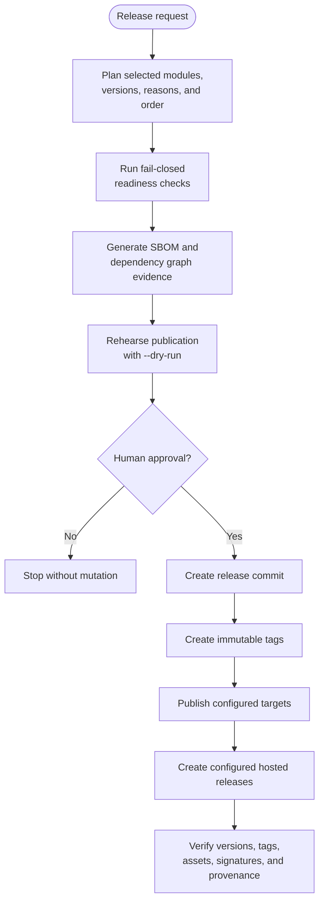
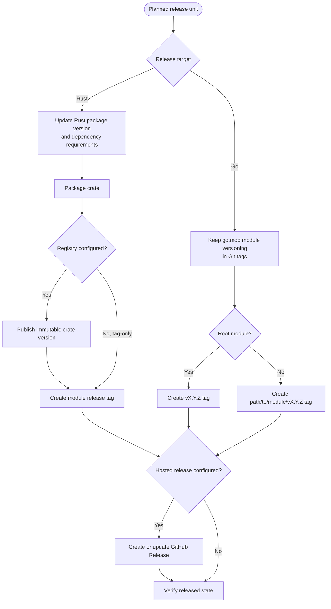

# Release modules

`toven release <action>` plans, checks, and executes releases across the repository dependency graph.

## Lifecycle

```bash
toven release plan
toven release status
toven release readiness
toven release sbom --out-dir target/toven/release/sbom
toven release depgraphs --out-dir target/toven/release/depgraphs
toven release publish --dry-run
toven release publish --yes
```

Run every preview before approving publication. See [release configuration](../config/release.md) for repository policy.



Planning and readiness are separate from mutation. `release tag` follows the approved path through tags and stops before target publication. `release publish` continues through publication and configured hosted releases.

## Rust and Go release outcomes

The common release plan branches only where ecosystem release conventions differ.



Dependency cascades are decided before this target-specific phase. A changed shared crate or module can bring dependents into the release plan when their dependency requirements must move.

## Actions

| Action | Purpose | Mutates external state |
|---|---|---|
| `plan` | Select modules, versions, reasons, and publication order | No |
| `status` | Compare declared, tagged, and published versions | No |
| `readiness` | Run configured go/no-go checks | No |
| `sbom` | Generate module SBOM files under `--out-dir` | Local artifacts only |
| `depgraphs` | Generate dependency graph files under `--out-dir` | Local artifacts only |
| `tag` | Create the release commit and tags, then optionally push | Yes |
| `publish` | Tag, publish, and create configured hosted releases | Yes |

`toven release` without an action is a usage error.

## Plan

```text
toven release plan [--output human|jsonl]
```

```bash
toven release plan
```

Example stdout:

```text
Module       Current  Next   Level  Reason      Input    Publish
rust:core    1.4.2    1.4.3  patch  changed     default  yes
rust:cli     2.1.0    2.1.1  patch  dependency  cascade  yes
```

The plan is deterministic and ordered for publication. JSONL adds cascade origin, prerelease channel, and up-to-date state.

## Status

```bash
toven release status
```

Example stdout:

```text
Module       Declared  Published  Latest tag
rust:core    1.4.2     yes        rust/core@1.4.2
```

Registry lookup is read-only.

## Readiness

```bash
toven release readiness
```

Example stdout:

```text
Check                Result  Detail
clean-tree           pass    worktree is clean
registry-idempotent  pass    declared versions are publishable
Verdict: go
```

Any failed check returns a non-zero exit status. Unknown readiness checks fail as invalid configuration.

## SBOM and dependency graphs

```bash
toven release sbom --out-dir dist/sbom
toven release depgraphs --out-dir dist/graphs
```

Artifact paths are written to stdout. Tool progress and unsupported-ecosystem skips use stderr. These commands write only under the selected output directory.

## Dry-run publication

```text
toven release publish --dry-run [--output human|jsonl]
```

```bash
toven release publish --dry-run
```

Example stdout:

```text
Module       Verdict             Target
rust:core    would-publish       crates-io
go:cache     would-tag           cache/v1.2.3
```

Dry-run resolves the real publication plan without changing manifests, commits, tags, registries, or hosted releases.

## Approve mutation

```bash
toven release tag --yes
toven release publish --yes
```

Mutating actions require `--yes`. Without it, Toven fails before opening the mutation pipeline.

Safety options:

| Option | Effect |
|---|---|
| `--yes` | Confirm a real release |
| `--no-push` | Keep release commits and tags local |
| `--allow-dirty` | Bypass the clean-worktree guard |

`--allow-dirty` is an explicit safety bypass and should not be used in release CI.

## Version overrides

Mutating actions accept per-run version decisions:

```bash
toven release publish --minor rust:core --yes
toven release publish --set-version rust:cli=2.0.0 --yes
toven release tag --pre rc --base v1.4.0 --offline --yes
```

| Option | Effect |
|---|---|
| `--patch <MODULE>` | Force a patch bump; repeatable |
| `--minor <MODULE>` | Force a minor bump; repeatable |
| `--major <MODULE>` | Force a major bump; repeatable |
| `--set-version <MODULE>=<VERSION>` | Set an exact version; repeatable |
| `--pre <CHANNEL>` | Use a configured prerelease channel |
| `--base <REF>` | Select the change baseline |
| `--offline` | Skip registry version queries and use tags for idempotency |

Conflicting overrides fail before mutation.

## Rust releases

Each Cargo package is versioned independently. A changed crate receives its configured bump. When a dependency requirement must change, Toven cascades a release into dependents and explains the origin in the plan. Registry-enabled crates publish in dependency order. Tag-only Rust modules skip registry publication.

Rust repositories can configure:

- default and per-module bump levels
- crates.io or tag-only release targets
- prerelease channels
- changelog and readiness policy
- GitHub Release creation and assets

## Go releases

Go releases are tag-based:

- root module: `v1.2.3`
- nested module: `cache/redis/v1.2.3`

Changed modules release independently unless dependency changes require a cascade. Test-only and benchmark modules should be explicitly excluded or made releasable in repository policy. Go tag grammar is fixed and rejects custom `tag_format`.

## Hosted GitHub Releases

When `[...release.host]` selects GitHub, Toven uses `gh` after the tag is pushed and registry publication succeeds.

Requirements:

```bash
gh auth status
```

`gh` reads `GH_TOKEN` or `GITHUB_TOKEN` from the environment. Toven does not place tokens in argv. Hosted release creation is skipped by `--dry-run` and `--no-push`.

## Output streams

- Read-only release tables and JSONL use stdout.
- Mutating progress, warnings, summaries, and errors use stderr.
- `--output jsonl` reserves stdout for records.

## Recovery

Published versions and pushed tags are immutable. Do not rewrite them after partial publication. Correct the repository state, produce a new plan, and publish a forward-fix version. `release status` identifies completed and pending modules before a retry.
