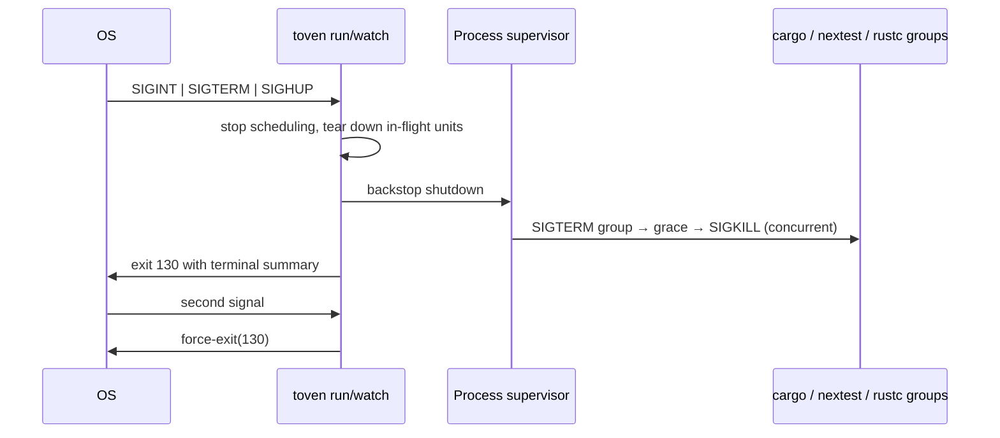

# Run tasks

Run a task for Rust modules:

```bash
toven test --workspace rust
```

Tasks are defined under `[ecosystems.<id>.tasks.<name>]`. Use `toven run <task>` when a task name collides with a reserved command.

## Syntax

```text
toven <task> [TOVEN_OPTIONS] [TASK_ARGUMENTS...]
toven run <task> [TOVEN_OPTIONS] -- [TASK_ARGUMENTS...]
```

```bash
toven check --workspace rust
toven run structure
```

## What happens during a run

A run loads configuration, discovers modules, builds the dependency graph, selects scope, renders argv, checks cache records, and executes misses in dependency waves.

Typical stderr:

```text
plan: 2 units in 2 waves
ok rust:core test
ok rust:cli test
summary: 2 passed
```

With `--output jsonl`, Toven events use stdout and child output uses stderr.

## Pass task arguments

Toven consumes recognized options at the start of the task argument list. The first token it does not own, and everything after it, is appended unchanged at `{args}`.

```bash
toven test --workspace rust integration --nocapture
```

Use `--` to pass a colliding flag:

```bash
toven test --workspace rust -- --dry-run
```

Inspect the resulting argv:

```bash
toven explain test --module rust:toven-cli
```

Toven does not correct unknown task flags because they may belong to the underlying command.

## Tool gates as tasks

Tool-specific gates are ordinary tasks. Toven resolves and runs them through the same machinery.

| Task | Ecosystem | Resolves to |
|---|---|---|
| `structure` | `command` | `ast-grep scan`, the declare-only `lib.rs` and `mod.rs` guard |
| `docs-build` | `command` | `mdbook build docs` |
| `deny` | `rust` | `cargo deny check advisories bans licenses sources` |
| `doctest` | `rust` | `cargo test --doc …`, the doctests nextest cannot run |

```bash
toven run structure
toven run deny --workspace rust
toven run docs-build
toven run doctest --workspace rust -- --all-features
```

The `command` ecosystem is Toven's generic-tool adapter. It owns tool-specific, language-agnostic gates that have no Cargo or Go home. A cargo-specific repo opt-in gate such as `deny` is a declared `[ecosystems.rust.tasks.deny]` task because it needs `deny.toml`.

See the [language- and tool-agnostic core](../engineering.md#language--and-tool-agnostic-core) principle. Inspect any resolved argv with `toven explain <task>`.

## Select scope

```bash
toven test --module toven-cli
toven test --module rust:toven-cli
toven test --module 'rust:*'
toven test --workspace rust
toven test --module rust:toven-cli --dependents
toven test --module rust:toven-cli --dependencies
```

Selectors may be a bare module name, canonical `ecosystem:name`, `workspace/name`, or a glob. Ambiguous bare names fail and list qualified candidates.

`--module` and `--workspace` are repeatable. They cannot be combined with `--base` or `--merge-base`.

## Select changed work

```bash
toven structure --base origin/main --merge-base
```

Changed modules and their dependents run. See [baseline selection](README.md#baseline-selection).

## Cache control

```bash
toven test --workspace rust --refresh
toven test --workspace rust --no-cache
```

- `--refresh` ignores existing records and writes successful replacements.
- `--no-cache` reads and writes no cache records.

The options are mutually exclusive. See [cache management](cache.md).

## Concurrency

```bash
toven test --workspace rust --jobs 1
toven test --workspace rust --jobs 4
toven test --workspace rust -j 4
```

`--jobs <N>` overrides `[toven].max_parallel`. `--jobs 1` executes serially and uses an inline stream under the default view.

## Compute budget

```bash
toven test --workspace go --compute-budget auto
toven test --workspace go --compute-budget 12
toven test --workspace go --compute-budget inherit
```

Where `--jobs` bounds how many units run at once, `--compute-budget` bounds the CPU parallelism handed to each spawned tool, overriding `[toven].compute_budget`. The engine splits the total budget across the units running concurrently and injects each unit's share through an ecosystem environment variable (Go reads `GOMAXPROCS`); a self-balancing toolchain such as Cargo keeps the whole budget. `auto` sizes the budget to the host CPUs, an integer sets a fixed total, and `inherit` (or `0`) injects nothing and lets every tool keep its own default parallelism. The value is never added to your argv. See [compute budget](../config/README.md#compute-budget) for the sizing model and per-ecosystem overrides.

## Live output

```bash
toven test --workspace rust --view auto
toven test --workspace rust --view tiles
toven test --workspace rust --view panes
toven test --workspace rust --view stream
```

| View | Behavior |
|---|---|
| `auto` | Select panes, tiles, or stream from terminal and concurrency conditions |
| `tiles` | One terminal region per active unit |
| `panes` | tmux panes when supported, otherwise tiles |
| `stream` | Deterministic linear output |

Non-terminal and JSONL runs always use stream behavior.

## Watch mode

```bash
toven test --workspace rust --watch
toven test --workspace rust --watch --watch-debounce-ms 500
```

Watch mode reruns the affected subgraph after file changes. Any stop signal (Ctrl+C, `kill`/IDE-stop, or a closed terminal) cancels active work and exits; see [Interrupting a run](#interrupting-a-run).

## Timeout and failure policy

```bash
toven test --workspace rust --timeout 90s --fail-fast
```

`--timeout` applies per execution unit. `--fail-fast` stops scheduling new work after the first failure.

## Interrupting a run

Toven treats every graceful stop signal the same way. Ctrl+C (`SIGINT`), a `kill` or IDE stop (`SIGTERM`), and a closed terminal or dropped SSH session (`SIGHUP`) all begin the same cooperative teardown: the engine stops scheduling new units, sends `SIGTERM` to every in-flight worker, tears down held processes, and prints the normal terminal summary before exiting with code `130`. A watched run cancels the active rerun and leaves watch mode the same way. You get a clean summary rather than a half-killed run, and nothing is left holding Cargo's `target/debug/.cargo-lock`.

Behind that cooperative phase sits a supervisor backstop. Each spawned `cargo`/`nextest`/`rustc` group is isolated into its own process group and registered with a process supervisor; a process-level signal reaps every registered group even if no individual unit observes the signal. This is what makes non-orphaning structural rather than incidental — the guarantee does not depend on which task happened to be holding a child when the signal arrived.

If a run is wedged and the first signal's cooperative drain does not finish, send the stop signal a **second** time. The second signal skips cooperation and force-exits immediately with code `130`.



The shutdown behavior is policy-driven, so an embedder can select the signal set, the cooperative drain deadline, and the second-signal exit code, and the supervisor exposes the grace period before escalation to `SIGKILL` and whether children are isolated into their own group. The `toven` CLI ships the defaults described above.

### The one residual: a hard kill of `toven` itself

`SIGKILL` (`kill -9`) cannot be intercepted, so a hard kill of the `toven` process itself runs no in-process cleanup. Each `cargo`/`nextest`/`rustc` group is isolated into its own process group (via `setpgid`) so cooperative teardown can signal the whole tree, but that isolation is not a death-link: Toven does not tie a child's lifetime to the parent (there is no `PR_SET_PDEATHSIG` on Linux, and the BSDs/macOS have no equivalent), so on **every** Unix platform a hard kill of `toven` can orphan a `cargo`/`nextest` group. The symptom is a `cargo` or `cargo-nextest` process reparented to `init` (parent PID `1`) still holding `target/debug/.cargo-lock`, which makes the next build block on `Blocking waiting for file lock on artifact directory`. Spot it with `pgrep -fl cargo` (look for a `cargo`/`nextest` process whose parent PID is `1`) and clear it by terminating that process. Prefer a graceful stop signal over `kill -9` so this never arises.

## Options

| Option | Effect |
|---|---|
| `--dry-run` | Plan without execution |
| `--explain` | Plan and report reasoning without execution |
| `--fail-fast` | Stop scheduling after the first failure |
| `--no-cache` | Bypass cache reads and writes |
| `--refresh` | Re-run and replace successful cache records |
| `--timeout <DURATION>` | Bound each unit, such as `30s` or `5m` |
| `--jobs <N>`, `-j <N>` | Limit concurrent units |
| `--compute-budget <auto\|inherit\|N>` | Cap CPU parallelism per spawned tool |
| `--base <REF>` | Select changed work against a Git baseline |
| `--merge-base` | Compare from the baseline's merge base |
| `--module <SELECTOR>` | Select modules; repeatable |
| `--workspace <SELECTOR>` | Select workspaces; repeatable |
| `--dependents` | Include reverse dependencies |
| `--dependencies` | Include forward dependencies |
| `--watch` | Re-run after source changes |
| `--watch-debounce-ms <N>` | Set watch debounce; default `200` |
| `--output human\|jsonl` | Select output format |
| `--view auto\|tiles\|panes\|stream` | Select output renderer |
| `--color auto\|always\|never` | Control status color |
