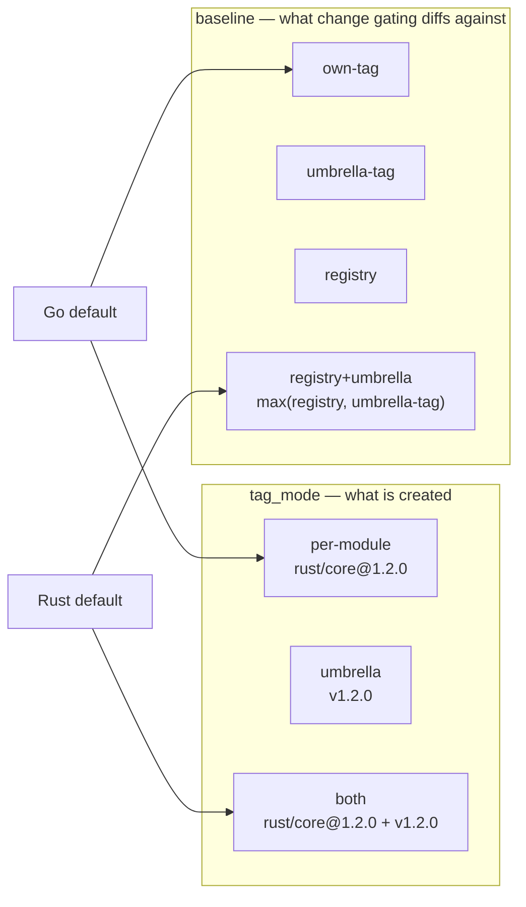

# Release configuration

Release policy lives under `[ecosystems.<id>.release]`. A module can override it under `[modules."<ecosystem>:<name>".release]`.

Run a read-only preview first:

```bash
toven release plan
```

Precedence is simple:

```text
release CLI override > module release override > ecosystem release policy > adapter default
```

`toven release plan` reports the winning version input for each module.

## Minimal release config

This is enough for a Rust crate release that publishes to crates.io, checks the tree, and requires a changelog entry:

```toml
[project]
name = "example"

[ecosystems.rust]
manifests = "auto"

[ecosystems.rust.release]
registry = "crates-io"
readiness = ["clean-tree", "registry-idempotent"]

[ecosystems.rust.release.changelog]
required = true
```

For a tag-only release, omit `registry` or set `publish = false` in the same block.

## Full example

Every key below is part of the strict release schema. Use only the fields your repository needs.

```toml
[ecosystems.rust.release]
strategy = "semver-cascade"
level = "auto"
dependent_version = "bump"
tag_format = "{ecosystem}/{module}@{version}"
tag_mode = "per-module"
baseline = "own-tag"
tag_message = "release {module} {version}"
sign_tags = true
sign_format = "openpgp"
signing_key = "ABCD1234"
commit_message = "chore: release"
push = true
push_branch = true
remote = "origin"
branches = ["main"]
registry = "crates-io"
publish = true
exclude = false
entrypoint = "toven"
umbrella = false
offline = false
token_env = "CARGO_REGISTRY_TOKEN"
visibility = "public"
readiness = ["clean-tree", "registry-idempotent"]

[ecosystems.rust.release.prerelease]
channels = ["alpha", "beta", "rc"]
branch_channels = { next = "beta" }

[ecosystems.rust.release.changelog]
path = "CHANGELOG.md"
required = true
roll = false

[ecosystems.rust.release.host]
forge = "github"
draft = false
prerelease = true
notes = "Release notes body"
assets = ["dist/core.tar.gz", "dist/SHA256SUMS"]

[ecosystems.rust.release.sign]
enabled = true
signer = "release-bot"
identity = "https://github.com/OWNER/REPO/.github/workflows/release.yml@.*"
issuer = "https://token.actions.githubusercontent.com"

[[ecosystems.rust.release.version_references]]
files = ["README.md"]
pattern = '{module} = "{version}"'

# Project-level lifecycle hooks wrap the verb (see the configuration guide).
[hooks.release]
pre = ["check"]
post = ["docs-build"]
```

## Main release keys

| Key | Type | Default | Meaning |
|---|---|---|---|
| `strategy` | `"semver-cascade"` or `"manifest"` | `"semver-cascade"` | How the next version is chosen |
| `level` | `"patch"`, `"minor"`, `"major"`, or `"auto"` | `"auto"` | Bump for changed modules |
| `dependent_version` | `"bump"` or `"upgrade"` | `"bump"` | Whether a dependent gets its own release after a dependency floor changes |
| `tag_format` | template string | Adapter tag scheme | Release tag template; Rust accepts it, Go rejects it |
| `tag_mode` | `"per-module"`, `"umbrella"`, or `"both"` | Adapter default | Which tags the train creates (see [Tag modes and baseline sources](#tag-modes-and-baseline-sources)) |
| `baseline` | `"own-tag"`, `"umbrella-tag"`, `"registry"`, or `"registry+umbrella"` | Adapter default | Where change detection anchors this module's baseline |
| `tag_message` | template string | Lightweight tag | Annotated-tag message template |
| `sign_tags` | boolean | `false` | Sign release tags; requires `tag_message` and a resolvable signing key |
| `sign_format` | `"openpgp"`, `"gpg"`, `"ssh"`, or `"x509"` | Git `gpg.format` | Git signing backend, only with `sign_tags = true` |
| `signing_key` | string | Git `user.signingkey` | Git signing key identifier, never key material |
| `commit_message` | template string | Adapter default | Release commit message template |
| `push` | boolean | `true` | Permit release commit and tag push |
| `push_branch` | boolean | `true` | Push the release commit branch as well as tags |
| `remote` | string | `"origin"` | Git remote for release pushes |
| `branches` | string list | Any branch | Allowed release branches; an empty list permits any branch |
| `registry` | string | None | Rust registry target; `"crates-io"` uses cargo's default registry |
| `publish` | boolean | Registry-driven | `false` selects tag-only publication |
| `exclude` | boolean | `false` | Remove the module from release planning, tagging, publishing, and hosting |
| `entrypoint` | `"toven"` or `"maintainer"` | `"toven"` | Who creates the tag and hosted Release |
| `umbrella` | boolean | `false` | Mark the module as the aggregate hosted-Release representative for its train |
| `offline` | boolean | `false` | Anchor idempotency on tags and skip registry lookups in status |
| `token_env` | string | None | Environment variable that holds the registry publish token |
| `visibility` | `"public"`, `"private"`, or `"internal"` | `"public"` | Intended registry exposure |
| `readiness` | string list | `[]` | Named fail-closed preflight checks |
| `version_references` | array of tables | None | Files whose version tokens `release bump` keeps in lock-step with the resolved versions |
| `on_resolved` | string list | None | Bump mid-mutation task references, each handed the resolved version map |

Templates accept release variables such as `{ecosystem}`, `{module}`, `{version}`, and `{channel}`. Unknown placeholders, blank names, and unsafe paths fail config validation. Unsupported readiness checks fail closed.

Project-level lifecycle hooks (`pre`/`post` task references around a verb) live under `[hooks.<verb>]`, not the release config — see [Lifecycle hooks](README.md#lifecycle-hooks).

A repository creates one release commit for all selected modules. `commit_message` must render identically for every module in that repository. Use module- or version-specific commit templates only when the repository releases one module at a time.

A pushing release usually updates the release branch and tags. Set `push_branch = false` when a protected release branch rejects direct pushes; Toven then pushes tags only and leaves the branch ref untouched. This setting is per repository, so all modules released together must agree.

## Version policy

`level = "auto"` resolves a normal change to a patch and a known breaking signal to a minor bump. Use explicit config or CLI overrides when a major bump is required.

`dependent_version = "bump"` is the safe cascade default. When a released dependency raises a requirement floor, the dependent receives its own release. `"upgrade"` raises the dependency floor without releasing the dependent; use it only when your ecosystem and repository allow that state.

### Version strategies

`strategy` changes only the version-decision step. Change detection, dependency cascade, idempotency, tag, and publish behavior stay the same.

- **`semver-cascade`** computes the next version from the baseline tag and detected changes. A stable bump finalizes a pending prerelease, dependency floor changes cascade into dependents, and `--pre <channel>` composes a prerelease channel.
- **`manifest`** cuts exactly `v${manifest version}` when the manifest version is ahead of the last release tag. If it is equal to or behind the baseline, previews report nothing to release and mutating runs fail closed with a typed error. `--pre` is invalid with `manifest` because the channel already lives in the declared version. Explicit argv such as `--set-version`, `--patch`, `--minor`, and `--major` still wins over either strategy.

| Baseline tag | Declared `Cargo.toml` | `semver-cascade` | `manifest` |
|---|---|---|---|
| `0.1.0-alpha.1` | `0.1.0-alpha.1` | `0.1.0` | Nothing to release in preview; fail closed in a run |
| `0.1.0-alpha.1` | `0.1.0-alpha.2` | `0.1.0` | `0.1.0-alpha.2` |
| `0.1.0-alpha.2` | `0.1.0` | `0.1.0` | `0.1.0` |
| `0.1.0` | `0.1.1` | `0.1.1` | `0.1.1` |
| `0.1.0` | `0.1.0-alpha.2` | Not applicable | Nothing to release in preview; fail closed in a run |

Use `manifest` when a workspace curates prerelease versions in `Cargo.toml`, such as successive `0.1.0-alpha.2` and `0.1.0-alpha.3` releases.

## Prereleases

```toml
[ecosystems.go.release.prerelease]
channels = ["alpha", "rc"]
branch_channels = { next = "alpha" }
```

| Key | Type | Default | Meaning |
|---|---|---|---|
| `channels` | string list | `[]` | Allowed semver prerelease channels |
| `branch_channels` | string map | `{}` | Branch-to-channel defaults |

Only declared channels can be selected:

```bash
toven release publish --dry-run --pre alpha
```

An explicit `--pre <channel>` wins over `branch_channels`. If no `--pre` is set, the checked-out branch may select a mapped channel. A branch not in the map, or a detached HEAD, cuts a stable release. Every mapped channel must appear in `channels`.

## Changelog

```toml
[ecosystems.rust.release.changelog]
path = "CHANGELOG.md"
required = true
roll = false
```

| Key | Type | Default | Meaning |
|---|---|---|---|
| `path` | string | `"CHANGELOG.md"` | Project-relative changelog path |
| `required` | boolean | `false` | Require a changelog entry for each directly changed release unit |
| `roll` | boolean | `false` | During `release bump`, move `## [Unreleased]` content under a versioned heading |

When `required = true`, Toven reads the configured file and requires a non-empty Keep a Changelog `## [Unreleased]` section. A bullet or prose line counts; empty subsection headings do not. Missing, unreadable, unsafe, or undocumented changelogs fail before mutation.

Modules selected only through a dependency cascade are exempt. Toven verifies changelog content and, when `roll = true`, relocates existing prose during the bump phase. It never fabricates release notes.

## Readiness

```toml
[ecosystems.rust.release]
readiness = ["clean-tree", "registry-idempotent"]
```

| Check | Meaning |
|---|---|
| `clean-tree` | Every member working tree must have no uncommitted changes |
| `registry-idempotent` | Registry-published modules must not declare a version already published to the registry |

`registry-idempotent` ignores tag-only and excluded modules. Use both checks for registry releases, and at least `clean-tree` for tag-only releases. Unknown readiness checks fail closed.

## Version references

`release bump` keeps declared version tokens outside the manifest — README examples, docs, install snippets — in lock-step with the versions it resolves. Declare them per ecosystem or per module:

```toml
[[ecosystems.rust.release.version_references]]
files = ["README.md", "crates/*/README.md"]
pattern = '{module} = "{version}"'
```

| Key | Type | Meaning |
|---|---|---|
| `files` | string list | Repo-relative file globs (`*`/`?`) whose lines carry version pins |
| `pattern` | string | Per-line pin pattern, a template over `{module}` and `{version}` |

During the bump mutation the engine rewrites only the `{version}` token of each line that matches the whole `pattern` and whose captured `{module}` resolves to a bumped version, against the authoritative post-bump version map. The rewrite is native (no shell), format-preserving (prose and non-matching lines are untouched), and idempotent (a line already at the resolved version is left byte-for-byte unchanged). The rewritten files are staged with the manifests.

## Bump on-resolved hooks

When a version-reference pattern cannot express the edit — regenerating a lockfile, a generated table, or a doc from the resolved versions — `on_resolved` runs task references mid-bump:

```toml
[modules."rust:core".release]
on_resolved = ["sync-versions", "regen-readme"]
```

Each reference is an ordinary task, resolved through the same task model as [`toven run`](../commands/run.md). The hooks run **after** every module's version is decided and its native version references are synced, but **before** anything is staged. Toven materializes the authoritative `key → version` map as a JSON file **outside** the repository and hands its path to each task argv-first (appended to the task's argv, no implicit shell), so the task can rewrite related files from the resolved versions. Every module is keyed by its canonical member-qualified identity (`member/ecosystem:name`, or `ecosystem:name` in a single repo), so no module is ever dropped; its package name, `ecosystem:name`, and bare name are added as extra keys only when unambiguous, and a name two modules share (across ecosystems or federation members) is omitted rather than resolving to the wrong version.

The working-tree edits each task produces join the same staged set as the manifests. A failing `on_resolved` task aborts the bump closed: every already-mutated module is restored and the untracked files the hooks created are removed, so nothing is staged and no partial state survives.

`on_resolved` differs from `[hooks.bump]`: a `[hooks.bump]` `pre` runs before versions are known and its `post` runs after staging, so neither can contribute intra-mutation staged edits. `on_resolved` runs inside the mutation with the resolved versions in hand.

## Hosted forge Releases

```toml
[ecosystems.rust.release.host]
forge = "github"
draft = false
assets = ["dist/core.tar.gz", "dist/SHA256SUMS"]
```

| Key | Type | Default | Meaning |
|---|---|---|---|
| `forge` | `"github"` or `"gitlab"` | None | Hosted-release adapter; no hosted Release is cut when unset |
| `draft` | boolean | `false` | Cut the hosted Release as a draft |
| `prerelease` | boolean | Derived from the version | Mark the hosted Release as a prerelease |
| `notes` | string | Changelog-derived notes | Explicit release-note body |
| `assets` | string list | `[]` | Project-relative exact paths to upload |

A shaping field such as `draft`, `prerelease`, `notes`, or `assets` requires `forge`. Asset paths are exact project-relative paths; glob expansion is not implemented. An unset `prerelease` flag derives from the selected version.

`host.assets` is resolved per module. A module that produces no binary artifacts should declare no assets. A mixed release can publish registry libraries with no assets and a binary app with archive assets in the same train.

GitHub and GitLab expose different release models:

- **GitHub** uses `gh`. It supports draft and prerelease flags, uploads assets as named files, and verifies an existing Release field-by-field, including each asset name and byte size.
- **GitLab** uses `glab`. It has no draft release, so `draft = true` is rejected before any `glab` call. It has no prerelease flag, so prerelease intent is recorded but not emitted or verified. GitLab assets are links with name and URL only, so existing Releases are verified by title, notes, and asset name. Creation uses `glab release create --no-update`, so existing tags are refused rather than edited.

One release tag maps to one hosted Release. If `tag_format = "v{version}"` maps several modules to the same tag, their notes and assets collapse into a deduplicated union and the shared tag is created once. Modules sharing a tag must agree on `draft`, `prerelease`, and rendered `tag_message`, or planning fails before mutation.

Hosted Release rehearsal is mutation-free. Real hosted Release creation runs after a pushing `release publish`, not after `release tag`.

## Registry, tag-only, and excluded modules

| Policy | Rust | Go |
|---|---|---|
| Registry | Publish the crate, then verify the immutable registry version | Not applicable |
| Tag-only | Create the immutable tag without registry publication | The tag is the release |
| Excluded module | Do not version, tag, publish, or host | Do not version or tag |

Toven resolves publication from `exclude`, `publish`, and `registry`:

- `registry = "crates-io"` selects Rust publication to crates.io.
- `registry = "<name>"` selects a named alternate Cargo registry. Toven runs `cargo publish --registry <name>` and forwards the token through `CARGO_REGISTRIES_<NAME>_TOKEN`, where the name is uppercased and non-alphanumerics become `_`. The registry must be configured in Cargo.
- No `registry` selects tag-only publication. Rust crates are not published by default.
- `publish = false` is an explicit tag-only declaration. In a per-module override, it can narrow an inherited ecosystem registry to tag-only for that module.
- `exclude = true` removes the module from release planning. In a per-module override, it can narrow an inherited ecosystem registry to excluded for that module.

Contradictions are rejected inside one block. Go cannot declare a registry. A block cannot combine `registry` with `publish = false`. An excluded module cannot declare registry publication, hosted assets, an image block, or `umbrella = true`.

Per-module narrowing is allowed because overrides merge field by field and the resolved policy is recomputed after the merge. `exclude` wins, then `publish = false`, then `registry`.

## Visibility

`visibility` records intended release exposure: `public`, `private`, or `internal`. It resolves like other release fields; ecosystem values are inherited, and module values override them.

Toven enforces visibility only where a target can violate it. crates.io is public-only, so a `private` or `internal` release targeting crates.io fails at plan time with a typed `release.visibility` error. The crates.io adapter enforces the same rule at the toolchain boundary. A tag-only release may carry any visibility, and a named alternate registry is assumed to support its own access controls.

Tag pushes and hosted forge Releases follow the remote repository's visibility. A forge Release has no independent public/private setting.

## Tag signing

Use these top-level release keys for signed git tags:

```toml
[ecosystems.rust.release]
tag_message = "release {module} {version}"
sign_tags = true
sign_format = "ssh"
signing_key = "release-key"
```

`sign_tags = true` always creates an annotated tag. It requires `tag_message` and a signing key resolvable from config or git. `sign_format` maps to git `gpg.format`, and `signing_key` maps to git `user.signingkey`. Both are key identifiers, not secrets.

## Artifact signing

```toml
[ecosystems.rust.release.sign]
enabled = true
signer = "release-bot"
identity = "https://github.com/OWNER/REPO/.github/workflows/release.yml@.*"
issuer = "https://token.actions.githubusercontent.com"
```

| Key | Type | Default | Meaning |
|---|---|---|---|
| `enabled` | boolean | `false` | Enable artifact signing |
| `signer` | string | Signer default | Non-secret signer identity or key selection |
| `identity` | string | None | Keyless verification identity regexp for `release verify --download` |
| `issuer` | string | None | Keyless verification OIDC issuer for `release verify --download` |

`toven release sign` signs the `SHA256SUMS` manifest with cosign and writes `SHA256SUMS.sig` and `SHA256SUMS.pem` sidecar assets. With no `signer`, cosign uses the keyless Sigstore default from the ambient OIDC token. A configured but unavailable signer fails the release closed.

`identity` and `issuer` are verification inputs, not secrets. Signing must be enabled when `signer` is set, and blank `signer`, `identity`, or `issuer` values fail validation.

## Artifact assembly and verification

Under a hosted-release policy, modules with `host.assets` can use Toven's release artifact verbs. The verbs scope to modules that declare assets, so registry-only libraries pass through untouched.

- `toven release package --target <triple>` archives an already-built binary into the declared archive asset for that target. Non-Windows targets use `.tar.gz`; `*windows*` targets use `.zip` and record the `.exe` suffix. It fails when the declared asset or built binary is missing.
- `toven release sbom` writes the CycloneDX SBOM and stages it into the declared `*.cdx.json` asset.
- `toven release checksums` digests every declared archive and the SBOM into the `SHA256SUMS` manifest asset, in declared order, using SHA-256.
- `toven release sign` signs `SHA256SUMS` into `.sig` and `.pem` sidecars.
- `toven release verify` checks archives. Local mode presence-checks each archive and, unless `--no-run`, extracts and checks the binary version. `--download` fetches archives plus `SHA256SUMS` and signature assets from the hosted Release, verifies the Sigstore signature first, then checksums, then extraction and version.

These verbs do not mutate git history. Under `--output jsonl`, they emit typed JSONL. Missing or mismatched inputs fail closed. CI provides external tools such as cosign and cargo-cyclonedx.

## Container-image release

A module shipped as a container image declares a `[…release.image]` block. The block is required for `toven release image` and is rejected on an excluded module.

```toml
[ecosystems.rust.release.image]
registry = "ghcr.io/acme"
mirrors = ["docker.io/acme"]
name = "toven"
tag = "{version}"
context = "services/api"
dockerfile = "services/api/Dockerfile"
sign = true
```

| Key | Type | Default | Meaning |
|---|---|---|---|
| `registry` | string | Required | Primary registry the image is pushed to |
| `mirrors` | string list | `[]` | Additional registries that receive the same digest |
| `name` | template string | Required | Image name template |
| `tag` | template string | `{version}` | Image tag template |
| `context` | string | Project root (`.`) | Project-relative build context |
| `dockerfile` | string | Builder default (`<context>/Dockerfile`) | Project-relative Dockerfile path |
| `sign` | boolean | `true` | Cosign-sign the pushed digest, keyless |

`name` and `tag` use the same release-template vocabulary as `tag_format`. `context` and `dockerfile` must be safe project-relative paths. Image publication is immutable: pushing an existing tag with a different digest fails closed. Registry credentials come from the ambient environment and never appear on argv or in logs.

`provenance` needs no config block. [`toven release provenance`](../commands/release.md#container-images-and-provenance) verifies that an attestation exists over the declared `host.assets` `SHA256SUMS` entries and every pushed `[…release.image]` digest; the CI trusted builder (`actions/attest-build-provenance`) creates it. A release may declare a manifest, an image, or both; it fails when neither exists.

## Entrypoint flows

`entrypoint` models who creates the release tag and hosted Release.

| Value | Meaning |
|---|---|
| `"toven"` | Toven bumps versions, writes the release commit, creates and pushes the tag, publishes, and cuts the hosted Release |
| `"maintainer"` | A maintainer already created the tag and hosted Release; Toven verifies them, then publishes, attaches assets, and verifies provenance |

In a maintainer-owned flow, the tag is an input. Toven never creates or moves it, mutates no manifest, and creates no release commit during publish. The manifest already declares the released version, so registry idempotency decides whether publish is still needed.

`release plan` and `release status` show each module's entrypoint. For maintainer-owned modules, `release status` also reports whether the required tag for the declared version exists.

## Umbrella trains

`umbrella = true` marks one module as the aggregate representative for a release train. It fronts a single hosted `vX.Y.Z` Release whose notes aggregate every member's changelog. Member crates keep independent versions and tags and can publish to registries, but they cut no individual forge Release.

A train with two umbrella modules is a configuration error. An excluded module cannot be an umbrella.

## Tag modes and baseline sources

Two orthogonal knobs describe how a release train tags and how it decides what changed. Both are optional and resolve to a per-ecosystem adapter default, so an existing `toven.toml` keeps its behavior without declaring either.

`tag_mode` chooses **which tags a run creates**:

| Value | Tags created |
|---|---|
| `per-module` | One tag per released module from its own `tag_format`. The umbrella module's own tag is not created. |
| `umbrella` | Only the single umbrella module's tag (e.g. `v1.2.3`); per-module tags are skipped. |
| `both` | Per-module tags for traceability **and** the umbrella tag. |

`baseline` chooses **where change detection anchors** a module's baseline — the point a run diffs against to decide whether the module changed and how far to bump:

| Value | Anchor |
|---|---|
| `own-tag` | The module's own latest matching release tag. |
| `umbrella-tag` | The member's umbrella tag: both the anchor version and the diff ref come from it. |
| `registry` | The registry's max published version for idempotency; the diff ref is the module's own tag. |
| `registry+umbrella` | `max(registry, umbrella-tag)` for the version, with the diff ref from the umbrella tag. |

`tag_mode` governs tag creation, `umbrella = true` marks *which* module is the umbrella, and `baseline` governs change gating. The three are independent, so a train can, for example, create `both` tag layouts while gating each crate on `registry+umbrella`.

The two knobs compose with the existing semantics without redefining them: `umbrella` still marks the aggregate hosted-Release representative, `entrypoint = "maintainer"` still verifies rather than creates tags — verifying whichever tags the mode implies, including the umbrella tag under `umbrella` or `both` — and `push_branch` and `exclude` are unchanged.



### Per-ecosystem defaults

The defaults encode the difference between the two registry models. For **Rust**, crates.io is the registry and git tags are traceability, so the default is `tag_mode = "both"` with a `baseline = "registry+umbrella"` anchor: per-crate tags plus one umbrella `v{version}` tag, and gating on `max(crates.io max published, version-at-the-umbrella-tag)`. For **Go**, per-module tags *are* the registry — `go get` needs them — so the default is `tag_mode = "per-module"` with `baseline = "own-tag"`.

This is why a Rust workspace with a single umbrella `vX.Y.Z` tag, per-crate crates.io history, and only some crates changed bumps just the changed crates (and their dependency cascade): the registry+umbrella anchor gives each crate a real baseline even though it has no per-crate tag. Earlier releases treated every such crate as an initial release and advanced nothing.

An umbrella-anchored default is only applied when the train declares exactly one umbrella module. If it declares none, the Rust default degrades to `tag_mode = "per-module"` / `baseline = "own-tag"` rather than demanding an umbrella the train never cuts. An explicit `umbrella-tag` or `registry+umbrella` value with no umbrella module declared is a plan-time typed error.

### Registry-failure downgrade

A `registry` or `registry+umbrella` baseline consults the ecosystem registry only to raise the idempotency anchor. When that lookup fails — an offline run, a registry outage — change detection does not abort. It downgrades to the umbrella-tag (or own-tag) anchor and completes, so a transient registry problem never blocks a release plan.

### Overriding the defaults

Both knobs follow the standard precedence — module override, then ecosystem policy, then adapter default:

```toml
# Force per-crate-tag baselines on a Rust module that opts out of the registry anchor.
[modules."rust:core".release]
baseline = "own-tag"
tag_mode = "per-module"
```

`release plan` reports the effective tag mode and baseline source per module (the `Tag mode` and `Baseline` columns, or `tag_mode` and `baseline_source` under `--output jsonl`), so the resolved choice is visible without inspecting config.

### Migration

No existing field is removed and no existing `toven.toml` needs edits. `tag_mode` and `baseline` are optional; when unset they resolve to the per-ecosystem defaults above. The visible change is a behavioral default, not a config break: a Rust workspace that previously anchored every module on its own tag now anchors on `registry+umbrella`, so an umbrella-tagged workspace change-gates correctly instead of treating each crate as an initial release. A project that genuinely wants the old per-crate-tag baseline opts in with an explicit `baseline = "own-tag"`. Go behavior is unchanged.

## Release phases and delegation

The release flow has these ordered phases: `select`, `bump`, `tag`, `package`, `sign`, `publish`, `host`, `image`, and `provenance`.

Toven owns the flow guarantees for every phase: mutation-free previews, gated mutation, immutable outputs, forward-fix recovery, and typed reporting. A phase is backed either **natively** by Toven or **delegated** to an external tool. Delegation is per phase and opt-in.

```toml
[ecosystems.go.release.phases.package]
backing = "delegated"

[ecosystems.go.release.phases.package.delegated]
tool = "goreleaser"
args = ["release", "--clean"]
preview = ["release", "--snapshot", "--clean"]
```

| Key | Type | Default | Meaning |
|---|---|---|---|
| `phases.<phase>.backing` | `"native"` or `"delegated"` | `"native"` | How the phase is backed |
| `phases.<phase>.delegated.tool` | string | Required for delegated phases | External executable |
| `phases.<phase>.delegated.args` | string list | None | Fixed leading args for the mutating invocation |
| `phases.<phase>.delegated.preview` | string list | Required | Mutation-free preview args |

Only `package`, `sign`, `image`, and `provenance` are delegable. Toven never delegates `select`, `bump`, `tag`, `publish`, or `host`.

A delegated phase must declare preview arguments. Secrets flow through the child-process environment, never argv. `package` and `sign` dispatch delegated backings today. Delegated `image` and `provenance` are rejected at plan time until their dispatch paths are wired, so leave them native.

## Safety rules

- Preview commands must not mutate manifests, commits, tags, registries, or hosted Releases.
- Real publication requires `--yes`, an allowed branch, and a clean tree.
- Release tags, registry versions, hosted Releases, and hosted assets are immutable.
- Tokens stay in environment variables or credential stores. `token_env` names a variable; it never contains the secret value.
- Pre-hooks run before mutation and abort the release on failure. Post-hooks run only after a successful release.
- Partial publication is recovered by a newly previewed and approved forward fix.

The clean-tree guardrail has no bypass. Hosted forge Releases are immutable create-or-verify: an existing Release must match the intended one, or the run fails with a conflict and never edits it in place.
