```mermaid
flowchart LR
    User[Developer command] --> CLI[toven CLI]
    CLI --> Config[Load strict toven.toml]
    Config --> Adapter[Adapter discovery]
    Adapter --> Graph[Module dependency graph]
    Graph --> Affected[Affected filter]
    Affected --> Plan[Execution plan]
    Plan --> Cache[Cache decision]
    Cache --> Exec[Run or skip units]
    Exec --> Report[Human / JSONL output]
```

# What Toven does

Toven is a task orchestrator for repositories with many modules. It keeps your commands, adds language-aware module discovery, plans affected work, schedules ready modules in parallel, and caches successful results.

Toven answers five questions about any task:

1. What will run?
2. Why will it run?
3. Why was something skipped?
4. What exact argv will execute?
5. Which baseline and changed files made this affected?

## A typical session

```bash
toven init                                     # onboarding wizard writes toven.toml
toven plan check --base origin/main --merge-base   # see what would run
toven check                                    # run it
toven test --nocapture                         # run with passthrough args
toven explain test --module rust:core          # see the exact planned argv
```

See the [getting started guide](getting-started.md) for a full walkthrough.

## How a run flows



Command ownership stays in your config. The CLI selects the task, adapters discover modules, the engine decides what runs together, and the execution layer renders only the argv you configured or the adapter provided. See [architecture](architecture.md) for the internals.

## Configuration

Toven uses one strict `toven.toml`:

- `[project]` — project name, root, and default baseline (`base_ref`).
- `[toven]` — report format, parallelism, and `[toven.cache]`.
- `[ecosystems.<id>]` — per-ecosystem discovery, run strategy, release policy, and per-task argv under `[ecosystems.<id>.tasks.<name>]`.
- `[groups.<name>]` — named module groupings with safety limits and optional group-scoped `run_strategy`/`tasks` overrides.
- `[[overlays]]` — explicit cross-ecosystem dependency edges native metadata cannot prove.
- `[[members]]` — multi-repo federation roots.

Share tasks, groups, or overlays across repos by factoring them into a file and pulling it in with `[toven].include = ["ci/shared-tasks.toml"]`. Included files must be committed. See [sharing task configuration](architecture.md#sharing-task-configuration).

## Multi-repo federation

A `toven.toml` can describe one repository or an umbrella that federates several. Each member is an independently runnable Toven project with its own `toven.toml`; the umbrella's `[[members]]` array names each member and its repo-relative root and composes them into one federated dependency graph. Affected planning and release both operate over that single graph. See [cross-repo federation](architecture.md#cross-repo-federation).

## Command surface

| Command | What it does |
|---------|--------------|
| `toven init` | Run the onboarding wizard to author a reviewable `toven.toml`. |
| `toven <task>` | Run any task defined in the config task table. |
| `toven <task> --watch` | Rerun the affected subgraph on every source change. |
| `toven <task> --refresh` | Re-run every unit and refresh the cache. |
| `toven <task> --timeout <duration>` | Bound each unit's runtime. |
| `toven plan <task>` | Show what would run (unit and wave counts). |
| `toven affected <task>` | List affected modules for a baseline (an unattributable change forces full activation with a diagnostic). |
| `toven explain <task>` | Show the planned unit(s): argv, dependencies, persistence (filter with `--module`). |
| `toven modules` | List discovered modules. |
| `toven graph` | Show the dependency graph. |
| `toven release plan` / `status` | Project the release cut or per-module publish/tag state (read-only). |
| `toven release readiness` / `sbom` / `depgraphs` | Run the fail-closed release preflight, generate a per-module CycloneDX SBOM, or render the dependency graph to a DOT artifact (read-only). |
| `toven release tag` / `publish` | Cut the release (commit/tag/push) or run the full pipeline through publish (`publish` rehearses under `--dry-run`). |
| `toven coverage` | Run the coverage task, aggregate the emitted profiles per module, and gate them against the resolved `[…coverage]` thresholds. |
| `toven cache stats` / `clean` / `path` | Inspect and manage the local cache. |

See the [command reference](commands/README.md) for full flag detail.

## Status

Pre-alpha, installed from source. The current surface covers strict TOML config, Rust and Go discovery, selector placeholders, readiness planning, affected detection, result caching, persistent tasks, and `toven init`. Distributed execution, remote cache, and toolchain installation are planned but not yet available.
