# Toven product

Toven is a developer-first task orchestrator for repositories with many modules. It keeps user-owned commands, adds language-aware module discovery, plans affected work, schedules ready modules, and caches successful results.

## User promise

```bash
toven generate
toven plan check --base origin/main --merge-base
toven check
toven test --nocapture
toven explain <ecosystem:module> test
```

Toven should answer:

1. What will run?
2. Why will it run?
3. Why was something skipped?
4. What exact argv will execute?
5. Which baseline and changed files made this affected?

## High-level workflow

```mermaid
flowchart LR
    User[Developer command] --> CLI[toven CLI]
    CLI --> Config[Load strict toven.toml]
    Config --> Adapter[Adapter discovery]
    Adapter --> Graph[Module dependency graph]
    Graph --> Affected[Affected filter]
    Affected --> Plan[Execution plan]
    Plan --> Cache[Cache decision]
    Cache --> Exec[Run or skip units]
    Exec --> Report[Human / JSONL output]
```



Toven keeps command ownership in project config. The CLI selects the task, adapters discover modules, the engine decides what can run together, and the execution layer only renders the argv that was configured or adapter-provided.

## Configuration experience

Toven uses one strict `toven.toml` with:

- `[project]` for project name, root, schema, and default baseline.
- `[toven]` for run-wide settings (report format, parallelism, cache) under `[toven.cache]`.
- `[ecosystems.<id>]` for per-ecosystem discovery options, run strategy, release policy, and per-task argv under `[ecosystems.<id>.tasks.<name>]`.
- `[groups.<name>]` for named module groupings and their guardrails.
- `[[overlays]]` for explicit cross-ecosystem dependency edges that native adapter metadata cannot prove.
- `[[members]]` for multi-repo federation roots.

## Multi-repo federation

A `toven.toml` can describe a single repository or an **umbrella** that federates several. Each *member* is an independently runnable Toven project with its own `toven.toml`; the umbrella's `[[members]]` array names each member and its repo-relative root, and the umbrella composes them into one federated dependency graph keyed internally by `{member, module}`. The umbrella adds only cross-member `[[overlays]]`/`[groups.*]`; it never rewrites a member's own config. String references such as umbrella group entries may drop the `member/` qualifier when a bare `ecosystem:name` is unambiguous across the union. Umbrella `[[overlays]]` endpoints are structured `{ ecosystem, module }` refs today, so each endpoint must resolve unambiguously across members. Members are never provisioned implicitly — a run never clones or checks out member repos — and a declared member missing on disk (or lacking its own `toven.toml`) is a hard error until it is provisioned or cloned at the configured path. Affected and release run over the one federated graph: each member resolves its own change baseline, and a release plans federated but commits and tags per member repo. See [architecture.md](architecture.md#cross-repo-federation) for the composition flow.

`toven generate` is the adoption path for new repositories. It detects each ecosystem present, renders a minimal reviewable starter config that leans on smart defaults, previews to stdout by default, and writes `<root>/toven.toml` with `--write`. Re-running is additive and idempotent: it adds only missing `[ecosystems.<id>]` sections, warns on existing ones, never touches `[project]`/`[toven]`, and preserves comments; `--force <id>` regenerates a single section.

Rust generation emits ecosystem-level Cargo manifest discovery. Cargo metadata is the source of truth for Rust path dependencies; generated overlays are reserved for relationships native metadata cannot prove.

## CLI surface

| Command | Product behavior |
|---------|------------------|
| `toven generate` | Generate a reviewable starter `toven.toml` without overwriting existing config by default. |
| `toven <task>` | Run a configured or adapter-default task. |
| `toven plan <task>` | Show what would run as a plan summary (unit/wave counts, and per-unit cache verdicts with `-v`). |
| `toven affected <task>` | Show affected modules for a baseline/head. |
| `toven explain <module> <task>` | Show the planned unit(s) for one module/task: argv, dependencies, and persistence. |
| `toven modules` | Show module discovery results. |
| `toven graph` | Show dependency graph. |
| `toven cache stats` | Show the local cache path, entry count, and byte size. |
| `toven cache clean` | Remove cache entries by policy. |

## Release scope

The current pre-alpha surface includes strict TOML config, Rust and Go discovery, per-ecosystem adapter configuration, selector placeholders, readiness planning, affected detection, successful-result caching, smoke coverage, workflow inspection commands, persistent tasks, and `toven generate`.

Out of scope for the first alpha: distributed execution, remote cache, CI token handling in core, toolchain installation, package installation, and Windows artifacts.
