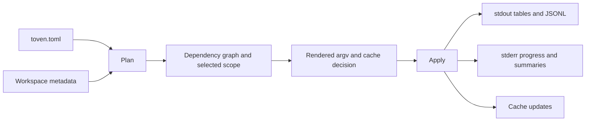

# Core concepts

This page explains the model behind Toven: repository-owned tasks, module-aware planning, and guarded execution.

Toven is an argv-first planner and executor for repositories containing multiple modules. It adds repository discovery, graph-aware selection, scheduling, caching, coverage aggregation, and release coordination without taking ownership of the commands a repository runs.

## Repository-owned commands

Tasks are named entries in `toven.toml`. Each task contains an argv template and scheduling policy. Toven validates and expands selectors but does not infer hidden flags or invoke a shell unless shell execution is explicitly configured.

```toml
[ecosystems.rust.tasks.test]
argv = ["cargo", "nextest", "run", "--manifest-path", "{module.manifest}", "{module.selector}", "{args}"]
selector = ["-p", "{module.package}"]
fan_out = "batchable"
```

Running `toven test -- --nocapture` appends `--nocapture` at `{args}` unchanged.

## Modules and workspaces

A module is the smallest discovered unit Toven plans. Rust modules are Cargo packages. Go modules are identified by their repository-relative module roots. A workspace groups modules discovered from the same Cargo workspace or Go workspace.

Canonical module references include the ecosystem:

```text
command:repo
rust:toven-engine
```

## Current workspace shape

The current Toven workspace is a Cargo workspace over `crates/*` and `apps/*`. Today that means `crates/toven-cli`, `toven-command`, `toven-core`, `toven-engine`, `toven-exec`, `toven-go`, `toven-model`, `toven-ports`, `toven-release`, `toven-runtime`, `toven-rust`, `toven-semver`, `toven-testkit`, `toven-vcs`, and `toven-version`, plus the thin binaries in `apps/toven`, `apps/toven-rs`, and `apps/toven-go`.

## Dependency graph

Adapters derive native dependency edges from Cargo or Go metadata. Explicit overlays describe cross-ecosystem edges that native tools cannot prove. The resulting graph controls affected selection, dependency expansion, execution waves, and release cascades.

## Plan and apply

Every task follows two phases:

1. **Plan:** load configuration, discover modules, build the graph, select scope, render argv, and decide cache use.
2. **Apply:** execute planned units, observe readiness, update successful cache records, and report results.

Read-only commands stop after planning. Task commands apply unless `--dry-run` or `--explain` is set.

This is the normal plan/apply flow.



## Affected work

With a Git baseline, Toven maps changed paths to modules and includes their dependents. Shared or repository-level inputs can activate the full graph because they may affect every module.

```bash
toven affected test --base origin/main --merge-base
```

## Execution waves

Dependency-respecting tasks run dependencies before dependents. Independent units in one wave run concurrently. Tasks configured with `run_strategy = "unordered"` may run the selected scope in one wave.

## Cache

Successful, cacheable units are reused only when source content, dependency results, task configuration, shared inputs, toolchain identity, and opted-in passthrough arguments still match. Persistent and state-changing tasks are not cached.

See [cache management](commands/cache.md).

## Release product

Toven's release product is a reviewable decision followed by guarded mutation. Before approval, the maintainer can inspect what changed, which modules joined through dependency cascades, the proposed versions and tags, changelog evidence, readiness results, publication order, hosted assets, and prerelease state.

Toven models release as an ordered **flow** of phases: select, bump, tag, package, sign, publish, host, image, and provenance. Toven itself follows the tag-only path: every current workspace package is `publish = false`, and the public release is the compiled binary set attached to a GitHub Release rather than crates published to crates.io.

Each phase can be backed either **natively** by Toven or **delegated** to a repository tool for that phase only. Even when a phase is delegated, Toven still owns planning, guardrails, and reporting around it.

The safety contract requires mutation-free previews, explicit approval, clean release trees, immutable published results, and forward-fix recovery. The exact policy lives in [release configuration](config/release.md) and the [release workflow](commands/release.md).

## Toven distribution

Toven ships checksum-verified, keyless Sigstore-signed binaries for Linux x86-64 and ARM64 (glibc), macOS x86-64 and Apple silicon, and Windows x86-64. `.github/workflows/release.yml` builds and publishes them behind a protected, manually approved environment. Each hosted Release also carries a CycloneDX SBOM and build provenance.

Install a pinned, checksum-verified binary from the [Releases page](https://github.com/kbukum/toven/releases), or build from source. See [installation](installation.md).

## Output contract

- stdout: requested tables, generated projections, and JSONL
- stderr: progress, child output, warnings, summaries, and errors

This separation lets automation parse stdout without losing human diagnostics. See [command output](commands/README.md#output-streams).
