# Toven product

Toven is a developer-first task orchestrator for repositories with many modules. It keeps user-owned commands, adds language-aware module discovery, plans affected work, schedules ready modules, and caches successful results.

> Status: the product is mid-redesign onto a hexagonal `crates/*` + `apps/*` stack. The workflows and CLI surface described here are the **target** behavior returning as the redesign steps land.

## User promise

```bash
toven generate --stdout
toven plan --task check --affected
toven check
toven test -- --no-capture
toven explain <module> test
```

Toven should answer:

1. What will run?
2. Why will it run?
3. Why was something skipped?
4. What exact argv will execute?
5. Which baseline and changed files made this affected?

## High-level workflow

```mermaid
flowchart LR
    User[Developer command] --> CLI[toven CLI]
    CLI --> Config[Load strict toven.toml]
    Config --> Adapter[Adapter discovery]
    Adapter --> Graph[Module dependency graph]
    Graph --> Affected[Affected filter]
    Affected --> Plan[Execution plan]
    Plan --> Cache[Cache decision]
    Cache --> Exec[Run or skip units]
    Exec --> Report[Human / JSON / JSONL output]
```



Toven keeps command ownership in project config. The CLI selects the task, adapters discover modules, the engine decides what can run together, and the execution layer only renders the argv that was configured or adapter-provided.

## Configuration experience

Toven uses one strict `toven.toml` with:

- `[project]` for project name, root, schema, and default baseline.
- `[toven]` for run-wide settings (report format, parallelism, cache) under `[toven.cache]`.
- `[ecosystems.<id>]` for per-ecosystem discovery options, run strategy, release policy, and per-task argv under `[ecosystems.<id>.tasks.<name>]`.
- `[groups.<name>]` for named module groupings and their guardrails.
- `[[overlays]]` for explicit cross-ecosystem dependency edges that native adapter metadata cannot prove.
- `[[members]]` for multi-repo federation roots.

`toven generate` is the adoption path for new repositories. It renders a reviewable starter config from structured generation fragments, previews to stdout by default, and refuses to overwrite an existing `toven.toml` unless `--write --overwrite` is explicit.

Rust generation emits ecosystem-level Cargo manifest discovery. Cargo metadata is the source of truth for Rust path dependencies; generated overlays are reserved for relationships native metadata cannot prove.

## Target CLI surface

> The CLI is being rebuilt on the `crates/*` + `apps/*` stack; the surface below describes the target behavior returning as the redesign steps land.

| Command | Product behavior |
|---------|------------------|
| `toven generate` | Generate a reviewable starter `toven.toml` without overwriting existing config by default. |
| `toven <task>` | Run a configured or adapter-default task. |
| `toven <task> --watch` | Watch files, debounce changes, and rerun affected modules/dependents. |
| `toven plan --task <task>` | Show what would run, why, and command argv. |
| `toven affected` | Show affected modules for a baseline/head. |
| `toven explain <module> <task>` | Explain one module/task cache and affected decision. |
| `toven modules` | Show module discovery results. |
| `toven graph` | Show dependency graph. |
| `toven cache stats` | Show local cache entries, size, and age. |
| `toven cache clean` | Remove cache entries by policy. |

## Release scope

The first alpha release should include strict TOML config, Rust discovery, per-ecosystem adapter configuration, selector placeholders, readiness planning, affected detection, successful-result caching, smoke coverage, workflow inspection commands, watch/persistent tasks, and `toven generate`.

Out of scope for the first alpha: distributed execution, remote cache, CI token handling in core, toolchain installation, package installation, and Windows artifacts.
