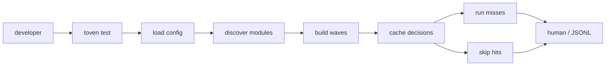
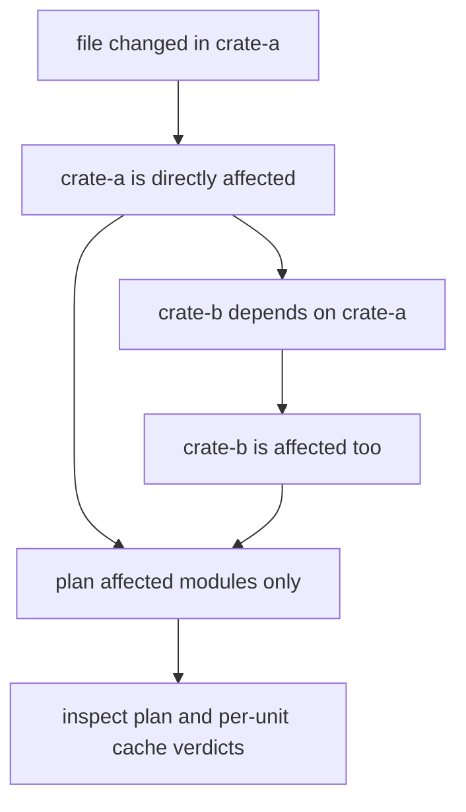
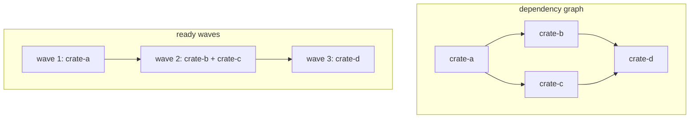
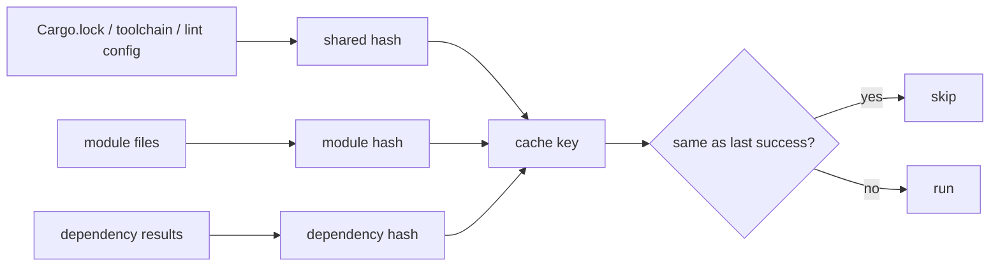
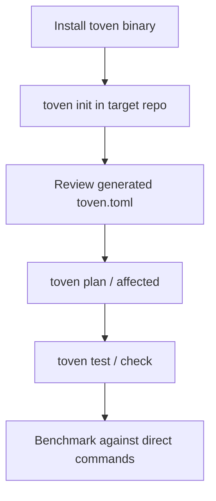

# Scenarios

Diagrams of the core runtime flows, each inspectable with `plan`, `affected`, `explain`, and JSONL output.

## Full task run

A full run uses the module graph. Toven skips valid cache hits and keeps dependency order for everything that must run.

## Affected run

Affected mode starts with changed files, maps them to owning modules, and adds dependent modules so downstream breakage is caught. `toven affected <task>` lists the module set; `toven plan <task> -v` shows the units and cache verdicts; `toven explain <task> --module <sel>` shows one unit's argv, dependencies, and persistence.

## Wave bundling

Modules in the same wave have no pending dependency between them. A `batchable` task runs a wave as one command, splitting only when a Cargo manifest boundary makes one command unsafe.

## Shared-input invalidation

Task-level `shared_inputs` invalidate every module using the task — `Cargo.lock`, `rust-toolchain.toml`, lint config, CI config. Write plain workspace paths (`Cargo.lock`, not `./Cargo.lock`). See [what invalidates cache](commands/cache.md#what-invalidates-cache).

## Installed-binary dry run

Adoption uses the installed binary and a generated config. Start with `toven init`, then add hand-written policy only where the real workflow needs it. See [benchmarking](benchmarking.md).
