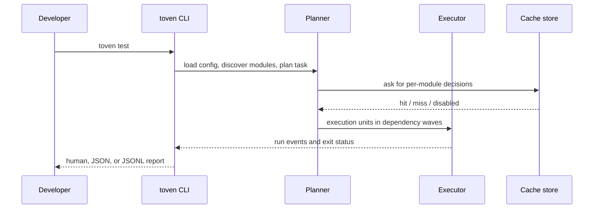
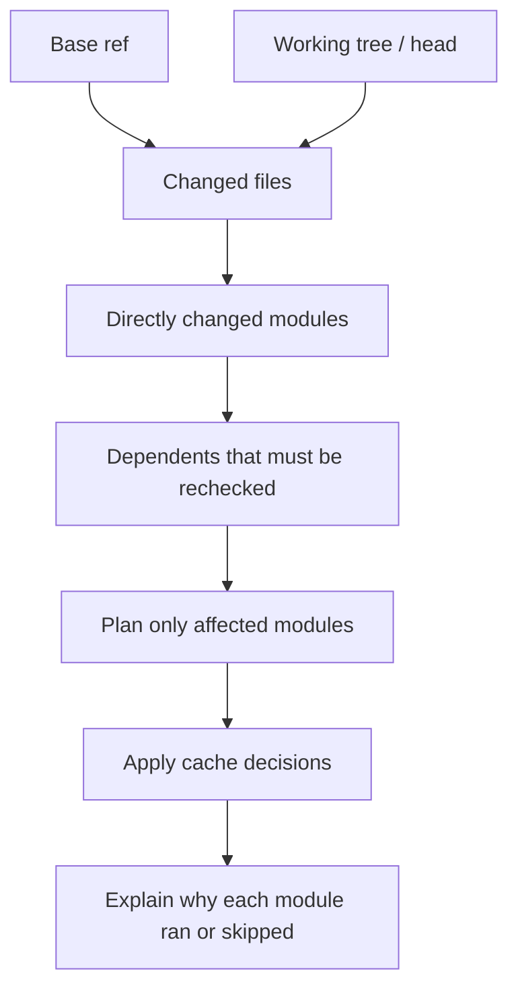
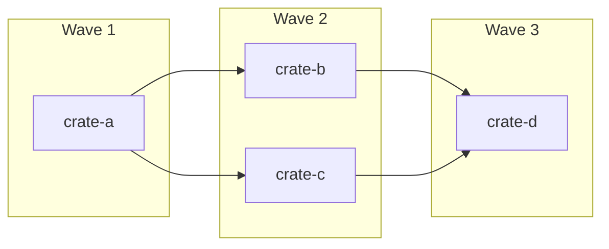
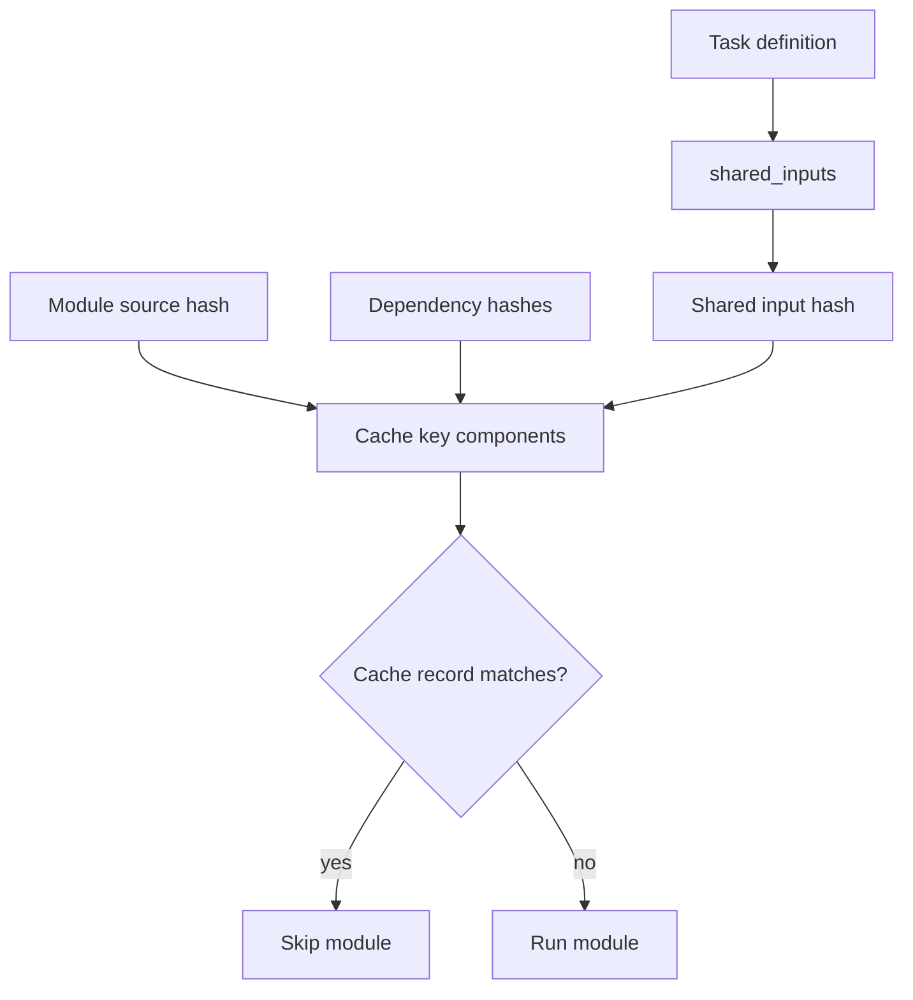
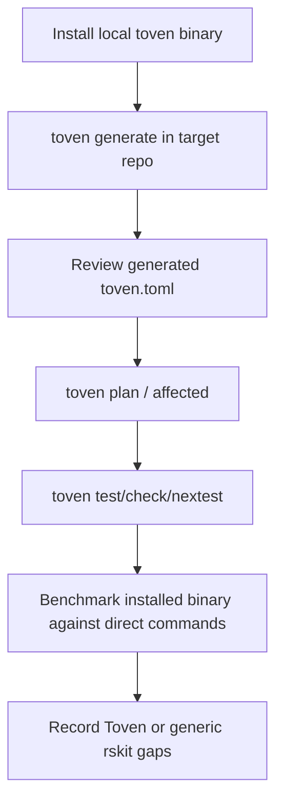

# Toven scenarios

This document describes the core runtime scenarios the CLI should make easy to
inspect with `plan`, `affected`, `explain`, JSON, and JSONL output.

## Full task run

Full runs discover every configured module for the selected task. Cache hits can
skip individual modules, but dependency order still shapes the execution waves.

## Affected run

Affected mode starts with changed files, maps them to owning modules, and adds
dependent modules so downstream breakage is not missed. `toven explain` should
show which baseline, files, dependency edges, and cache inputs contributed to a
module decision.

## Wave bundling

Modules in the same wave are ready at the same time. For `batch-ready`, Toven
bundles ready modules into execution units, then splits by manifest when a wave
contains modules discovered from different manifests.

## Shared-input invalidation

Use task-level `shared_inputs` for files and directories that can invalidate all
modules using the task, such as `Cargo.lock`, `rust-toolchain.toml`, deny/lint
configuration, and CI configuration.

## Installed-binary rehearsal

The rskit adoption path should use the installed binary and generated
instructions. Repository-specific config should come from `toven generate` first
and only add hand-written policy where the real workflow needs it.
