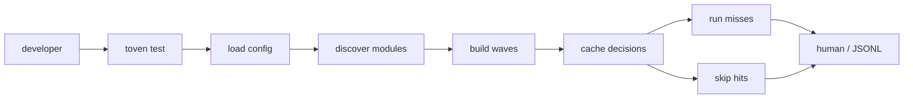
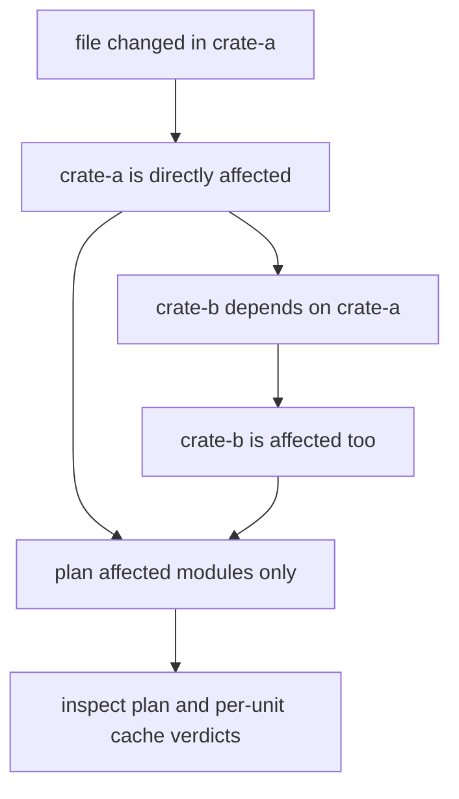
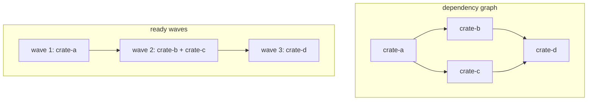
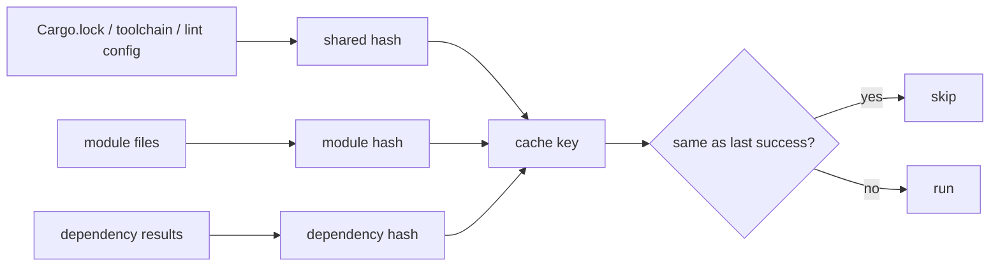
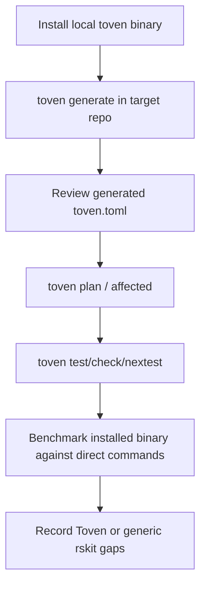

# Toven scenarios

This document describes the core runtime scenarios the CLI makes easy to inspect with `plan`, `affected`, `explain`, human output, and JSONL output.

## Full task run

A full run still uses the module graph. Toven skips modules that are valid cache hits, but it keeps dependency order for everything that must run.

## Affected run

Affected mode starts with changed files, maps them to owning modules, and adds dependent modules so downstream breakage is not missed. `toven affected <task>` lists the resulting module set for a baseline, and `toven plan <task>` (with `-v`) shows the planned units and their cache verdicts. `toven explain <ecosystem:module> <task>` is a planned-unit view: it prints the unit's argv, dependencies, and persistence for one module and task.

## Wave bundling

Modules in the same wave have no pending dependency between them. In `batchable`, Toven tries to run a wave as one command, then splits only when a manifest boundary makes one command unsafe.

## Shared-input invalidation

Use task-level `shared_inputs` for files and directories that can invalidate all modules using the task, such as `Cargo.lock`, `rust-toolchain.toml`, deny/lint configuration, and CI configuration. Write them as plain paths inside the workspace, for example `Cargo.lock` instead of `./Cargo.lock`; templates, globs, `.` components, parent paths, and absolute paths are rejected.

## Installed-binary rehearsal

The rskit adoption path should use the installed binary and generated instructions. Repository-specific config should come from `toven generate` first and only add hand-written policy where the real workflow needs it. The rskit benchmark case intentionally requires that adopted `toven.toml` before it runs.
